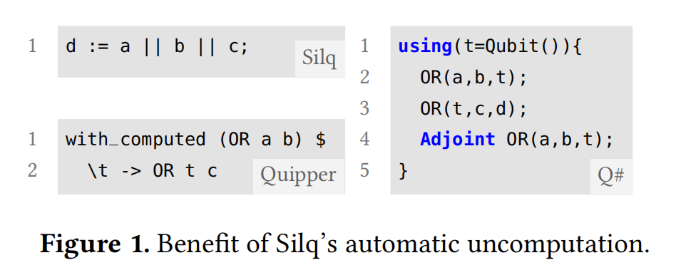

# 目录

1. **自动非计算的优势**：展示了自动非计算相对于现有语言中的显式非计算的优势。
2. **Silq概述**：
   - Silq注释
   - Silq语义
   - 非计算
   - 防止错误：拒绝无效程序
3. **Silq-Core语言片段**：
   - Silq-Core的语法
   - Silq-Core的类型和注释
4. **类型规则**：介绍了Silq的类型规则，包括如何处理常量、变量、测量等。
5. **Silq-Core的语义**：详细解释了Silq-Core的类型保持、注释的语义、物理性等。
6. **Silq评估**：对比了Silq与Q#和Quipper的区别，并对Silq的进一步实现进行了讨论。

# 1. 自动非计算的优势

Silq语言中自动非计算功能相对于现有语言中的显式非计算的优势。这一部分的内容主要包括以下几个方面：

## **显式非计算**

现有量子编程语言（如Q#和Quipper）中实现非计算的复杂性，程序员需要明确地进行量子操作来移除程序状态中的临时值。这种做法不仅增加了编码的复杂度，而且降低了代码的直观性。

## **自动非计算**

在Silq中，程序的类型系统利用特殊的注解来确保只有那些在量子算法中可以安全地进行非计算的值才会被自动地丢弃。这种机制简化了编程过程，使得程序员无需关注临时值的显式移除。

## **实例**

Silq和其他量子编程语言在实现非计算时的不同。这些示例显示了Silq在简化非计算过程方面的优势，特别是在减少编程的复杂性和提高代码可读性方面。

# 2. Silq概述

## **Silq记号**

该部分介绍了在Silq中使用的记号，强调了其中一些关键的类型记号：

* **Classical Types**

* **Qfree Functions**
* **Constant Parameters**
* **Lifted Functions**

这些记号帮助Silq处理临时值的自动非计算和类型系统的安全性

## **Silq语义**

在这部分中，通过Grover算法的例子来展示Silq的语义，包括对

* **Input State**

* **Superpositions**

* **Loops**

* **Conditionals**

  其中特别介绍了如何在不引起不期望的测量的情况下安全地丢弃临时变量。

## **非计算**

* 非计算的概念：即如何在量子计算中安全地移除不再需要的临时值。

Silq通过其类型系统的设计，确保只有那些可以安全非计算的值才会被自动地丢弃。通过Grover算法的例子，展示了如何在不影响程序的物理实现的情况下，安全地实现自动非计算。

## **防止错误**

* **拒绝无效程序**：Silq如何利用其类型系统来拒绝那些可能导致非物理或非法行为的程序。无效程序的示例，以及如何通过调整类型注释或程序结构来修正这些问题。

总体来看，这一部分深入讲述了Silq语言的设计原理和特点，强调了其在自动非计算、类型安全以及提供直观语义方面的优势。通过对各种编程语境的讨论，展示了Silq如何有效地简化量子编程，并提高代码的可读性和安全性。

#3. Silq-Core

第6部分“Silq-Core语言片段”深入探讨了Silq编程语言的核心部分，即Silq-Core。这一部分主要从以下几个方面对Silq-Core进行了详细的解读：

## **Silq-Core的语法**

这一小节详细介绍了Silq-Core的语法结构。包括基本的语法元素，如变量声明、函数定义、控制流语句等。特别强调了Silq语言中的语法简洁性和直观性，以及如何通过这些语法结构来表达复杂的量子操作。

- **表达式**：Silq-core 的表达式包括常量和内置函数，变量，测量和反转量子操作。

- **通用性**：对单个量子位的任意操作（例如，通过 rotX, rotY 和 rotZ 启用），Silq-core 对量子计算是通用的，即它可以以任意精度近似任何量子操作。

  

## **Silq-Core的类型和注释**

在这一小节中，详细解释了Silq-Core中的类型系统和注释。讨论了如何通过类型和注释来确保量子程序的正确性和安全性。例如，介绍了Silq中不同的类型（如量子位类型、整数类型等）以及如何利用这些类型进行高效、安全的量子编程。

* **原始类型**：Silq-core 包括标准的原始类型，包括 1（只包含元素“()”的单例类型）和 B（描述单个量子位的布尔类型）。添加其他原始类型（如整数或浮点数）到 Silq-core 是直接的。

- **product和函数**：Silq-core 也支持product
- **记号**：记号表示了对 Silq-core 表达式和函数的计算的限制，确保其程序的物理性这部分内容总结了 Silq-Core 语言片段的核心特性，包括其语法结构和类型系统，以及如何通过注释来保证程序的物理可行性。

## **Silq-Core的优势和特点**

* 编写量子程序时的简洁性
* 直观性以及高效性
* 程序员更容易地理解和实现复杂的量子算法。

整体来看silq在量子编程领域中的具有巨大创新和优势，尤其是在提高编程效率和代码可读性方面的重要贡献。

在 Silq-core 中，类型规则是一套规定了如何合法地结合和操作不同数据类型的规则。它们对于保证程序的正确性和物理可行性至关重要。以下是对这些类型规则的详细解读：

#4. 类型规则

####  基本类型

- **原始类型**：包括布尔类型（B）和单例类型（1）。布尔类型用于表示量子位，而单例类型表示一个只有一个值的类型。
- **复合类型**：包括product类型（如：τ1 × τ2）和函数类型。product类型用于表示多个值的组合，而函数类型表示从一组输入到输出的映射。

####  函数类型

- **函数类型**：在 Silq-core 中，函数类型通过箭头（→）表示，例如 τ1 → τ2 表示从类型 τ1 到类型 τ2 的函数。
- **类型注释**：函数参数和函数本身可以通过 βi 和 α 进行注释。这些注释提供了关于函数参数和行为的额外信息。

####  类型安全和物理可行性

- **类型安全**：类型规则确保了类型安全，即不允许将不兼容的数据类型混合使用。例如，不允许将一个布尔类型与一个整数类型相加。
- **物理可行性**：注释在确保物理可行性方面发挥重要作用。例如，某些操作可能只对未测量的量子位有效，而对已测量的量子位则不适用。

####  类型推断

- **类型推断**：Silq-core 允许在某些情况下自动推断变量和表达式的类型。这可以简化代码编写，同时保持类型安全。

####  类型检查

- **编译时类型检查**：在编译过程中，Silq-core 会对程序进行类型检查，以确保所有操作都是类型安全的。这有助于在程序运行之前发现潜在的错误。

这些类型规则是 Silq-core 的核心组成部分，它们不仅确保了程序的类型安全和逻辑正确性，还保证了程序的物理可行性，这对于量子编程尤为重要。通过这些规则，Silq-core 能够有效地管理和操作量子和经典数据，为量子程序设计提供了强大而灵活的框架。

# 5. Silq-Core 的语义

Silq-Core 的语义涉及该语言如何解释和执行代码，以及不同构造和操作如何在量子计算的上下文中发挥作用。：

#### 基础概念

- **量子和经典计算的结合**：Silq-Core 设计用于结合量子和经典计算。它允许在量子位上进行量子操作，同时使用经典逻辑控制这些操作。
- **量子状态的管理**：Silq-Core 提供了一系列操作来管理量子状态，如创建、操作和测量量子位。

####  量子操作

- **量子门**：包括标准的量子门（如 Hadamard、Pauli-X、CNOT 等），它们是量子算法的基本构建块。
- **测量**：测量操作是将量子位的量子状态转换为经典信息的过程。这是连接量子和经典计算的关键步骤。

#### 控制流

- **条件语句**：Silq-Core 支持经典和量子条件。例如，可以基于量子位的测量结果来决定程序的后续路径。
- **函数调用**：函数调用可以是经典的，也可以包含量子操作。这使得程序可以在更高层次上组合量子和经典逻辑。

#### 程序的物理可行性

- **注释和限制**：Silq-Core 通过注释和类型系统中的限制来确保程序的物理可行性。这意味着编写的程序必须符合量子物理的基本原则。

#### 类型系统与语义的交互

- **类型推断**：类型系统与语义紧密相连。类型推断帮助程序员更轻松地编写符合物理规则的代码。
- **错误处理**：类型系统可以在编译阶段捕获可能的错误，防止非法或物理上不可行的操作被执行。

#### 量子计算的通用性

- **通用性**：Silq-Core 的设计使其具备执行任意量子计算的能力。这意味着理论上可以使用 Silq-Core 实现任何量子算法。

总的来说，Silq-Core 的语义深入探讨了量子和经典计算的结合，提供了一种有效的方式来管理和操纵量子数据。通过其独特的类型系统和注释，Silq-Core 保证了编写的程序既符合逻辑正确性，又遵守量子物理的原则。这使得 Silq-Core 成为一个强大且灵活的工具，适用于量子程序设计和量子算法的开发。

# 6. Silq的评估

对比了 Silq 和其他量子编程语言，特别是 Q# 和 Quipper。以下是对这些比较的分析：

#### 与 Q# 的比较

1. **代码简洁性**：在解决 Microsoft Q# 编码竞赛的 28 个任务时，使用 Silq 编写的解决方案与 Q# 的参考解决方案（减少了 46%）和前 10 名参赛者的平均解决方案（减少了 59%）相比，显示出更高的代码简洁性。

2. **量子原语、注释和低级量子门的使用**：与 Q# 相比，Silq 需要的量子原语、注释和低级量子门数量只有一半。这表明 Silq 编写的程序更易于阅读和编写。

3. **类型系统和自动解计算**：Silq 支持自动解计算和更高级的类型系统，包括依赖类型、子类型和类型转换，而 Q# 则没有这些特性。

   

#### 与 Quipper 的比较

1. **代码长度**：在编码三角形查找算法时，Silq 需要的代码量比 Quipper 少 38%。在某些例子中，甚至减少了高达 64%。

2. **自动解计算的缺失**：与缺乏自动解计算的 Quipper 相比，Silq 通过自动解计算减少了代码的复杂性和长度。Quipper 需要显式的解计算和辅助函数，而 Silq 不需要。

3. **内置函数和门的数量**：Quipper 提供了大量的内置函数和基本门，而 Silq 只提供了有限的基本门和反转类型，但没有牺牲表达能力。

   

总体上，分析表明 Silq 在编写量子程序时提供了更高的简洁性和表达能力，同时减少了对低级量子原语的依赖。这使得 Silq 成为一种更易于学习和使用的量子编程语言。

# 

