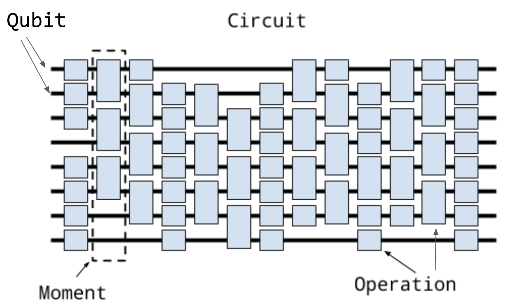
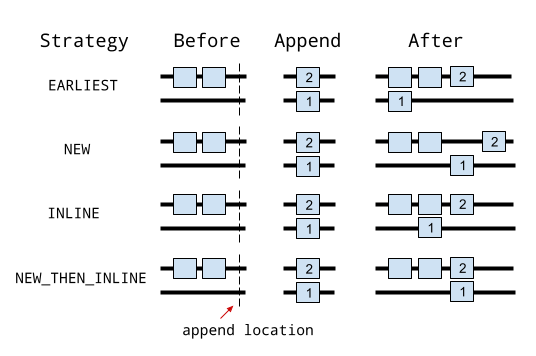
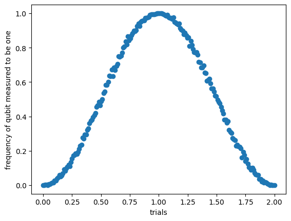

# Cirq——Google Quantum AI

- a Python software library

- for writing, manipulating, and optimizing quantum circuits 

## Qubits

相比于真正的量子比特，cirq 量子比特没有任何状态，因为量子比特的实际状态保持在量子处理器中，或模拟状态向量中。

创建量子电路的第一部分是定义一组要在其上作用的量子比特（也成为量子寄存器）

### 定义方法

Cirq有三种定义量子比特的主要方法

- `cirq.NamedQubit`：用抽象名称标记量子比特

  由名字定义的量子比特可以用于抽象算法，以及还没有映射到硬件的算法

  示例：

  ```python
  q0 = cirq.NamedQubit('source')
  q1 = cirq.NamedQubit('target')
  ```

- `cirq.LineQubit`：在线性阵列中用数字标记的量子比特

  示例：

  单独定义：

  ```python
  q3 = cirq.LineQubit(3)
  ```

  在一个范围中定义：

  ```python
  q0, q1, q2 = cirq.LineQubit.range(3)
  #创建LineQubit(0),LineQubit(1), LineQubit(2)
  ```

- `cirq.GridQubit`：在矩形晶格中由两个数字标记的量子比特

  示例：

  单独定义：
  ```python
  q4_5 = cirq.GridQubit(4, 5)
  ```

  在矩阵中批量定义：

  ```python
  qubits = cirq.GridQubit.square(4)
  # 创建16个量子比特，从(0,0)到(3,3)
  ```

### 设备

`cirq.Device`是预打包的量子比特集，包含量子比特及他们的一组使用规则。`cirq.Device`可以被用于确保双量子比特门仅用于相邻的量子比特（和其他约束）。

示例：

```python
print(cirq_google.Sycamore)
```

```markdown
                                             (0, 5)───(0, 6)
                                             │        │
                                             │        │
                                    (1, 4)───(1, 5)───(1, 6)───(1, 7)
                                    │        │        │        │
                                    │        │        │        │
                           (2, 3)───(2, 4)───(2, 5)───(2, 6)───(2, 7)───(2, 8)
                           │        │        │        │        │        │
                           │        │        │        │        │        │
                  (3, 2)───(3, 3)───(3, 4)───(3, 5)───(3, 6)───(3, 7)───(3, 8)───(3, 9)
                  │        │        │        │        │        │        │        │
                  │        │        │        │        │        │        │        │
         (4, 1)───(4, 2)───(4, 3)───(4, 4)───(4, 5)───(4, 6)───(4, 7)───(4, 8)───(4, 9)
         │        │        │        │        │        │        │        │
         │        │        │        │        │        │        │        │
(5, 0)───(5, 1)───(5, 2)───(5, 3)───(5, 4)───(5, 5)───(5, 6)───(5, 7)───(5, 8)
         │        │        │        │        │        │        │
         │        │        │        │        │        │        │
         (6, 1)───(6, 2)───(6, 3)───(6, 4)───(6, 5)───(6, 6)───(6, 7)
                  │        │        │        │        │
                  │        │        │        │        │
                  (7, 2)───(7, 3)───(7, 4)───(7, 5)───(7, 6)
                           │        │        │
                           │        │        │
                           (8, 3)───(8, 4)───(8, 5)
                                    │
                                    │
                                    (9, 4)
```

该例子使用cirq附带的设备`cirq_google.Sycamore`，它是一个具有54个量子比特的菱形网络，模仿了Google发布的早期硬件。

## Gates and operations

- Gate：门，表示在量子比特上发生的物理过程。
- Operation：操作，最常见的操作类型为`GateOperation`。

`cirq.gate`可以应用于一个或多个量子比特，可以通过`gate.on(*qubits)`或`gate(*qubits)`实现。这样做将一个`cirq.Gate` 转化为一个 `cirq.Operation`。

如：`cirq.H`是一个对象，`Gate cirq.H(cirq.LineQubit(1)) Operation`是应用于特定量子比特（行量子比特数1）的Hadamard矩阵门。

代码示例：

```python
# This is a Pauli X gate. It is an object instance.
x_gate = cirq.X
# Applying it to the qubit at location (0, 0) (defined above)
# turns it into an operation.
x_op = x_gate(qubits[0])
print(x_op)
```

```
X(q(0, 0))
```

### 门

- 单量子比特泡利门：cirq.X, cirq.Y, cirq.Z
- 常见双量子比特门：cirq.CZ, cirq.CNOT, cirq.SWAP

**cirq.X**: Paoli X gate

```python
cirq.X(
    *qubits, **kwargs
)
```

酉矩阵(exponent = 1)：
$$
\begin{bmatrix}
0 & 1\\1 & 0
\end{bmatrix}
$$
**cirq.Y**: Paoli Y gate

```python
cirq.Y(
    *qubits, **kwargs
)
```

酉矩阵(exponent = 1)：
$$
\begin{bmatrix}
0 & -i\\i & 0
\end{bmatrix}
$$
**cirq.Z**: Paoli Z gate

```python
cirq.Z(
    *qubits, **kwargs
)
```

酉矩阵(exponent = 1)：
$$
\begin{bmatrix}
1 & 0\\0 & -1
\end{bmatrix}
$$
**cirq.CZ**: the controlled Z gate

酉矩阵(exponent = 1)：
$$
\begin{bmatrix}
1 &&&\\&1&&\\&&1 &\\ &&&-1
\end{bmatrix}
$$
**cirq.CNOT**: the controlled NOT gate

酉矩阵(exponent = 1)：
$$
\begin{bmatrix}
1 &&&\\&1&&\\&&&1\\ &&1&
\end{bmatrix}
$$
**cirq.SWAP**: the swap gate

酉矩阵(exponent = 1)：
$$
\begin{bmatrix}
1 &&&\\&&1&\\&1& &\\ &&&1
\end{bmatrix}
$$
**cirq.M**

```python
cirq.M(
    *target,#应测量的量子比特，可以指定为单独的函数参数或使用量子比特可迭代的单个参数
    key: Optional[Union[str, 'cirq.MeasurementKey']] = None,
    invert_mask: Tuple[bool, ...] = (),#Truthy或Falsey值的列表
    confusion_map: Optional[Dict[Tuple[int, ...], np.ndarray]] = None
) -> cirq.Operation
```

返回应用于所有给定量子比特的单个 MeasurementGate，若量子比特不是Qid的实例返回ValueError。

### 使用示例

```python
cnot_gate = cirq.CNOT
pauli_z = cirq.Z

# Use exponentiation to get square root gates.
sqrt_x_gate = cirq.X**0.5

# Some gates can also take parameters
sqrt_sqrt_y = cirq.YPowGate(exponent=0.25)

# Create two qubits at once, in a line.
q0, q1 = cirq.LineQubit.range(2)

# Example operations
z_op = cirq.Z(q0)
not_op = cirq.CNOT(q0, q1)
sqrt_iswap_op = cirq.SQRT_ISWAP(q0, q1)

# Use the gates you specified earlier.
cnot_op = cnot_gate(q0, q1)
pauli_z_op = pauli_z(q0)
sqrt_x_op = sqrt_x_gate(q0)
sqrt_sqrt_y_op = sqrt_sqrt_y(q0)
```

## Circuits and Moments

### Circuits的层次结构



cirq中量子程序的主要表示形式是`Clircuit`类。如上图层次结构依据量子比特的概念。从低到高有以下层次：

- 在cirq中，量子比特和其他量子对象由基类`cirq.Qid`的子类实例标识，不同的`Qid`子类可被用于不同目的。

- 下一个层次是`cirq.Gate`，将gate作用于量子比特使得其被转化为`cirq.Operation`。

- Moment: Operations的集合，这些动作在同一个抽象时间片内起作用；每个Operation必须应用于一组不相交的量子比特。

  Moment可以看作量子电路的一个垂直切片。

  ```python
  cz = cirq.CZ(qubits[0], qubits[1])
  x = cirq.X(qubits[2])
  moment = cirq.Moment(x, cz)
  
  print(moment)
  ```

  ```
  ╷ 0 1 2
  ╶─┼───────
  0 │ @─@ X
    │
  ```

- 顶层Circuit: `Moments`的集合，其中的第一个`Moment`包含将被应用的第一个`Operations`

**两个时刻组成的电路示例**：

```python
cz01 = cirq.CZ(qubits[0], qubits[1])
x2 = cirq.X(qubits[2])
cz12 = cirq.CZ(qubits[1], qubits[2])
moment0 = cirq.Moment([cz01, x2])
moment1 = cirq.Moment([cz12])
circuit = cirq.Circuit((moment0, moment1))

print(circuit)
```

```
(0, 0): ───@───────
           │
(0, 1): ───@───@───
               │
(0, 2): ───X───@───
```

### 电路构建

电路(Circuits)可以通过不同的方式构建。

#### **使用Circuit.append方法**

将一个新的时刻添加到量子比特：

```python
q0, q1, q2 = [cirq.GridQubit(i, 0) for i in range(3)]
circuit = cirq.Circuit()
circuit.append([cirq.CZ(q0, q1), cirq.H(q2)])

print(circuit)
```

```
(0, 0): ───@───
           │
(1, 0): ───@───

(2, 0): ───H───
```

继续执行下列操作将添加完整时刻：

```python
circuit.append([cirq.H(q0), cirq.CZ(q1, q2)])
print(circuit)
```

```
(0, 0): ───@───H───
           │
(1, 0): ───@───@───
               │
(2, 0): ───H───@───
```

上述操作也可以一次完成：

```python
circuit = cirq.Circuit()
circuit.append([cirq.CZ(q0, q1), cirq.H(q2), cirq.H(q0), cirq.CZ(q1, q2)])

print(circuit)
```

将得到相同结果。

**Append函数**

有两种使用方法：

- 逐个添加每个操作

  ```python
  circuit = cirq.Circuit()
  qubits = cirq.LineQubit.range(3)
  circuit.append(cirq.H(qubits[0]))
  circuit.append(cirq.H(qubits[1]))
  circuit.append(cirq.H(qubits[2]))
  print(circuit)
  ```

  ```markdown
  0: ───H───
  
  1: ───H───
  
  2: ───H───
  ```

- 添加可迭代操作（可以使用预构造的列表）

  ```python
  circuit = cirq.Circuit()
  ops = [cirq.H(q) for q in cirq.LineQubit.range(3)]
  circuit.append(ops)
  print(circuit)
  ```

  ```markdown
  0: ───H───
  
  1: ───H───
  
  2: ───H───
  ```

#### 插入策略

`cirq.InsertStrategy`定义给定指定位置时如何把`Operations`插入到`Circuit`中。这里位置由`Moment`在`circuit`中的索引定义。

有四种插入策略：

- [`InsertStrategy.EARLIEST`](https://quantumai.google/reference/python/cirq/InsertStrategy#EARLIEST)（默认）：

  从插入位置向后扫描，直到找到操作触及受插入操作影响的量子比特的时刻。该操作将添加到该位置之后的时刻。

  示例1：`Operation`被插入到第一个`Moment`

  ```python
  from cirq.circuits import InsertStrategy
  
  circuit = cirq.Circuit()
  circuit.append([cirq.CZ(q0, q1)])
  circuit.append([cirq.H(q0), cirq.H(q2)], strategy=InsertStrategy.EARLIEST)
  
  print(circuit)
  ```

  ```
  (0, 0): ───@───H───
             │
  (1, 0): ───@───────
  
  (2, 0): ───H───────
  ```

  示例2：

  所有Hadamard门都尽可能向左推，只要没有重叠就放入同一`Moment`。若将操作应用于相同量子比特，则他们会按插入顺序的序列处理。在下面的示例中，两个量子比特门重叠，被放置在连续的时刻中。

  ```python
  print(cirq.Circuit(cirq.SWAP(q, q + 1) for q in cirq.LineQubit.range(3)))
  ```

  ```
  0: ───×───────────
        │
  1: ───×───×───────
            │
  2: ───────×───×───
                │
  3: ───────────×───
  ```

- [`InsertStrategy.NEW`](https://quantumai.google/reference/python/cirq/InsertStrategy#NEW)

  插入的每个操作都在新的moment创建。在不希望插入的操作干扰其他操作时尤其有效。

  示例：

  ```python
  circuit = cirq.Circuit()
  circuit.append([cirq.H(q0), cirq.H(q1), cirq.H(q2)], strategy=InsertStrategy.NEW)
  
  print(circuit)
  ```

  ```
  (0, 0): ───H───────────
  
  (1, 0): ───────H───────
  
  (2, 0): ───────────H───
  ```

- [`InsertStrategy.INLINE`](https://quantumai.google/reference/python/cirq/InsertStrategy#INLINE)：

  尝试将要插入的操作添加到所需插入位置之前的点。但是，如果已经存在影响要插入的操作所触及的任何量子比特的现有操作，则会创建一个新时刻。

  示例：

  ```python
  circuit = cirq.Circuit()
  circuit.append([cirq.CZ(q1, q2)])
  circuit.append([cirq.CZ(q1, q2)])
  circuit.append([cirq.H(q0), cirq.H(q1), cirq.H(q2)], strategy=InsertStrategy.INLINE)
  
  print(circuit)
  ```

  ```
  (0, 0): ───────H───────
  
  (1, 0): ───@───@───H───
             │   │
  (2, 0): ───@───@───H───
  ```

-  and [`InsertStrategy.NEW_THEN_INLINE`](https://quantumai.google/reference/python/cirq/InsertStrategy#NEW_THEN_INLINE)：

  在第一个操作所需的插入位置处创建一个新的moment，然后根据`InsertStrategy.INLINE`插入。

  示例：

  ```python
  circuit = cirq.Circuit()
  circuit.append([cirq.H(q0)])
  circuit.append([cirq.CZ(q1, q2), cirq.H(q0)], strategy=InsertStrategy.NEW_THEN_INLINE)
  
  print(circuit)
  ```

  ```
  (0, 0): ───H───H───
  
  (1, 0): ───────@───
                 │
  (2, 0): ───────@───
  ```

**不同插入策略的图示**


### 电路切片和迭代

电路可以迭代和切片。

**迭代**

当它们被迭代时，迭代中的每个项目都是一个moment：

```python
circuit = cirq.Circuit(cirq.H(q0), cirq.CZ(q0, q1))
for moment in circuit:
    print(moment)
```

```
  ╷ 0
╶─┼───
0 │ H
  │
  ╷ 0
╶─┼───
0 │ @
  │ │
1 │ @
  │
```

**切片**

当circuit被切片时，会生成一个只有与切片对应moments的新的circuit

示例：

```python
circuit = cirq.Circuit(cirq.H(q0), cirq.CZ(q0, q1), cirq.H(q1), cirq.CZ(q0, q1))
print(circuit[1:3])
```

```
(0, 0): ───@───────
           │
(1, 0): ───@───H───
```

**应用：**

- 丢弃最后一个moment：`circuit[:-1]`
- 反转电路：`circuit[::-1]`

### 嵌套电路

电路可以使用`cirq.CircuitOperation`彼此嵌套，这对于简明扼要地定义大型重复电路很有用。需要序列化的电路尤其受益于这一点，因为在电路的 Python 构造中使用的循环和函数不会在序列化中捕获。

**使用方法：**

子电路必须首先被“冻结”，以表明不会对其进行进一步的更改。

```python
subcircuit = cirq.Circuit(cirq.H(q1), cirq.CZ(q0, q1), cirq.CZ(q2, q1), cirq.H(q1))
subcircuit_op = cirq.CircuitOperation(subcircuit.freeze())
circuit = cirq.Circuit(cirq.H(q0), cirq.H(q2), subcircuit_op)
print(circuit)
```

```
[ (0, 0): ───────@─────────── ]
               [                │            ]
(0, 0): ───H───[ (1, 0): ───H───@───@───H─── ]───
               [                    │        ]
               [ (2, 0): ───────────@─────── ]
               │
(1, 0): ───────#2────────────────────────────────
               │
(2, 0): ───H───#3────────────────────────────────
```

也可以直接构建冻结电路：

```python
circuit = cirq.Circuit(
    cirq.CircuitOperation(
        cirq.FrozenCircuit(cirq.H(q1), cirq.CZ(q0, q1), cirq.CZ(q2, q1), cirq.H(q1))
    )
)
print(circuit)
```

 `CircuitOperation`类似一个函数：默认情况下，它的行为类似于它所包含的电路，但可以向它传递参数，以改变它操作的量子比特、重复的次数和其他属性。简洁起见，也可以在同一“外部”电路中多次引用`CircuitOperation`s。

```python
subcircuit_op = cirq.CircuitOperation(cirq.FrozenCircuit(cirq.CZ(q0, q1)))

# Create a copy of subcircuit_op that repeats twice...
repeated_subcircuit_op = subcircuit_op.repeat(2)

# ...and another copy that replaces q0 with q2 to perform CZ(q2, q1).
moved_subcircuit_op = subcircuit_op.with_qubit_mapping({q0: q2})
circuit = cirq.Circuit(repeated_subcircuit_op, moved_subcircuit_op)
print(circuit)
```

```
[ (0, 0): ───@─── ]
(0, 0): ───[            │    ]────────────────────────────────────────────────────────────────
           [ (1, 0): ───@─── ](loops=2)
           │
(1, 0): ───#2─────────────────────────────#2──────────────────────────────────────────────────
                                          │
                                          [ (0, 0): ───@─── ]
(2, 0): ──────────────────────────────────[            │    ]─────────────────────────────────
                                          [ (1, 0): ───@─── ](qubit_map={q(0, 0): q(2, 0)})
```

大多数情况下，`CircuitOperation`的行为和一般操作一样：只是它的量子比特包含circuit，它可以放置在任何尚未包含这些量子比特操作的`Moment`中。因此， `CircuitOperation`s 可以用于表示更复杂的操作时序，例如在一个量子比特上并行执行三个操作，在另一个量子比特上并行执行两个操作：

```python
subcircuit_op = cirq.CircuitOperation(cirq.FrozenCircuit(cirq.H(q0)))
circuit = cirq.Circuit(
    subcircuit_op.repeat(3), subcircuit_op.repeat(2).with_qubit_mapping({q0: q1})
)
print(circuit)
```

```
(0, 0): ───[ (0, 0): ───H─── ](loops=3)─────────────────────────────────

(1, 0): ───[ (0, 0): ───H─── ](qubit_map={q(0, 0): q(1, 0)}, loops=2)───
```

`CircuitOperation`s 也可以嵌套在彼此内部，达到任意深度：

```python
qft_1 = cirq.CircuitOperation(cirq.FrozenCircuit(cirq.H(q0)))
qft_2 = cirq.CircuitOperation(cirq.FrozenCircuit(cirq.H(q1), cirq.CZ(q0, q1) ** 0.5, qft_1))
qft_3 = cirq.CircuitOperation(
    cirq.FrozenCircuit(cirq.H(q2), cirq.CZ(q1, q2) ** 0.5, cirq.CZ(q0, q2) ** 0.25, qft_2)
)
# etc.
```

最后，`mapped_circuit`将在所有重复和重新映射后返回 `CircuitOperation`表示的电路。默认情况下，只“展开”一层 `CircuitOperation`，可以通过设置`deep=True`递归展开所有层。

```python
# A large CircuitOperation with other sub-CircuitOperations.
print('Original qft_3 CircuitOperation')
print(qft_3)
# Unroll the outermost CircuitOperation to a normal circuit.
print('Single layer unroll:')
print(qft_3.mapped_circuit(deep=False))
# Unroll all of the CircuitOperations recursively.
print('Recursive unroll:')
print(qft_3.mapped_circuit(deep=True))
```

```
Original qft_3 CircuitOperation
[                                 [ (0, 0): ───────@───────[ (0, 0): ───H─── ]─── ]    ]
[ (0, 0): ───────────────@────────[                │                              ]─── ]
[                        │        [ (1, 0): ───H───@^0.5───────────────────────── ]    ]
[                        │        │                                                    ]
[ (1, 0): ───────@───────┼────────#2────────────────────────────────────────────────── ]
[                │       │                                                             ]
[ (2, 0): ───H───@^0.5───@^0.25─────────────────────────────────────────────────────── ]
Single layer unroll:
                                [ (0, 0): ───────@───────[ (0, 0): ───H─── ]─── ]
(0, 0): ───────────────@────────[                │                              ]───
                       │        [ (1, 0): ───H───@^0.5───────────────────────── ]
                       │        │
(1, 0): ───────@───────┼────────#2──────────────────────────────────────────────────
               │       │
(2, 0): ───H───@^0.5───@^0.25───────────────────────────────────────────────────────
Recursive unroll:
(0, 0): ───────────────@────────────@───────H───
                       │            │
(1, 0): ───────@───────┼────────H───@^0.5───────
               │       │
(2, 0): ───H───@^0.5───@^0.25───────────────────
```

## Using parameter sweeps

cirq电路允许门在电路中将符号作为自由参数，这对于变分算法尤其有用，变分算法会改变电路中的参数以优化成本函数。

**参数**：cirq使用`sympy`库将`sympy.Symbol`作为参数添加到门和操作上。

电路完成后，可以使用`sweep`填入每个参数的可能值。以下可以用作`sweep`：

- `cirq.Points`:为一个特定符号手动指定值的列表，作为浮点数序列。
- `cirq.Linspace`:从起始值到结束值的线性扫描。
- `cirq.ListSweep`:为多个不同符号手动指定的值列表，指定为字典列表。
- `cirq.Zip`和`cirq.Product`:Sweeps可以通过压缩结合在一起，或通过笛卡尔积按列表组合扫描。

参数化电路和扫描可以通过将`run()`改为`run_sweep(sweep)`运行。

示例：扫描X gate的指数

```python
import sympy

# Perform an X gate with variable exponent
q = cirq.GridQubit(1, 1)
circuit = cirq.Circuit(cirq.X(q) ** sympy.Symbol('t'), cirq.measure(q, key='m'))

# Sweep exponent from zero (off) to one (on) and back to two (off)
param_sweep = cirq.Linspace('t', start=0, stop=2, length=200)

# Simulate the sweep
s = cirq.Simulator()
trials = s.run_sweep(circuit, param_sweep, repetitions=1000)

# Plot all the results
x_data = [trial.params['t'] for trial in trials]
y_data = [trial.histogram(key='m')[1] / 1000.0 for trial in trials]
plt.scatter('t', 'p', data={'t': x_data, 'p': y_data})
plt.xlabel("trials")
plt.ylabel("frequency of qubit measured to be one")
plt.show()
```



## Unitary matrices and decompositions

许多量子运算都由酉矩阵表示，可以通过`cirq.unitary(operation)`来访问矩阵（可应用于支持该协议的门、操作、电路，并返回其表示对象的酉矩阵）。

示例：

```python
print('Unitary of the X gate')
print(cirq.unitary(cirq.X))

print('Unitary of SWAP operator on two qubits.')
q0, q1 = cirq.LineQubit.range(2)
print(cirq.unitary(cirq.SWAP(q0, q1)))

print('Unitary of a sample circuit')
print(cirq.unitary(cirq.Circuit(cirq.X(q0), cirq.SWAP(q0, q1))))
```

```
Unitary of the X gate
[[0.+0.j 1.+0.j]
 [1.+0.j 0.+0.j]]
Unitary of SWAP operator on two qubits.
[[1.+0.j 0.+0.j 0.+0.j 0.+0.j]
 [0.+0.j 0.+0.j 1.+0.j 0.+0.j]
 [0.+0.j 1.+0.j 0.+0.j 0.+0.j]
 [0.+0.j 0.+0.j 0.+0.j 1.+0.j]]
Unitary of a sample circuit
[[0.+0.j 0.+0.j 1.+0.j 0.+0.j]
 [1.+0.j 0.+0.j 0.+0.j 0.+0.j]
 [0.+0.j 0.+0.j 0.+0.j 1.+0.j]
 [0.+0.j 1.+0.j 0.+0.j 0.+0.j]]
```

## Decompositions

许多门可以分解(decomposition)为由更简单的操作和门实现的等效电路，分解通过`cirq.decompose`协议实现。

**示例**：

一个Hadamard H gate可以被分解为X gate和Y gate：

```python
print(cirq.decompose(cirq.H(cirq.LineQubit(0))))
```

```text
[(cirq.Y**0.5).on(cirq.LineQubit(0)), cirq.XPowGate(global_shift=-0.25).on(cirq.LineQubit(0))]
```

三比特Toffoli门（相当于一个controlled-controlled-X gate），许多设备不支持三量子比特门，因此将他们分解为一比特和双量子比特门很重要，但分解的代价是大大延长了电路。

```python
q0, q1, q2 = cirq.LineQubit.range(3)
print(cirq.Circuit(cirq.decompose(cirq.TOFFOLI(q0, q1, q2))))
```

```
0: ───T────────────────@─────────────────────────────────@─────────────────────────────@────────────────────────────@───────────────────────────────────────
                       │                                 │                             │                            │
1: ───T───────Y^-0.5───@───Y^0.5────@───T^-1────Y^-0.5───@────────Y^0.5───@───Y^-0.5───@──────Y^0.5────@───Y^-0.5───@──────Y^0.5────@───────────────────────
                                    │                                     │                            │                            │
2: ───Y^0.5───X────────T───Y^-0.5───@───Y^0.5───T────────Y^-0.5───────────@───Y^0.5────T^-1───Y^-0.5───@───Y^0.5────T^-1───Y^-0.5───@───Y^0.5───Y^0.5───X───
```

## Transformers

转换器可以对电路进行修改，通常需要组合或修改操作使其更高效、更短。

**cirq.merge_single_qubit_gates_to_phxz**

将连续单比特操作合并为单个`PhasedXZ`操作

```python
q = cirq.GridQubit(1, 1)
c = cirq.Circuit(cirq.X(q) ** 0.25, cirq.Y(q) ** 0.25, cirq.Z(q) ** 0.25)
print(c)
c = cirq.merge_single_qubit_gates_to_phxz(c)
print(c)
```

```
(1, 1): ───X^0.25───Y^0.25───T───
(1, 1): ───PhXZ(a=0.304,x=0.333,z=0.142)───
```

## Simulation

cirq捆绑了一个模拟器，可以计算高达20个量子比特限制的电路，可以通过`cirq.Simulator()`初始化。两种使用方法：

- `simulator()`：模拟电路时，模拟器可以直接访问和查看生成的波函数，对调试、学习和理解电路的工作原理非常有用。
- `run()`：当使用实际的量子设备时，只能访问计算的最终结果，并且必须对结果进行采样才能获得结果的分布。将模拟器作为采样器运行会模仿此行为，并且仅返回位字符串作为输出。

**示例**：模拟2-quit ''Bell State''

```python
# Create a circuit to generate a Bell State:
# 1/sqrt(2) * ( |00⟩ + |11⟩ )
bell_circuit = cirq.Circuit()
q0, q1 = cirq.LineQubit.range(2)
bell_circuit.append(cirq.H(q0))
bell_circuit.append(cirq.CNOT(q0, q1))

# Initialize Simulator
s = cirq.Simulator()

print('Simulate the circuit:')
results = s.simulate(bell_circuit)
print(results)

# For sampling, we need to add a measurement at the end
bell_circuit.append(cirq.measure(q0, q1, key='result'))

# Sample the circuit
samples = s.run(bell_circuit, repetitions=1000)
```

```
Simulate the circuit:
measurements: (no measurements)

qubits: (cirq.LineQubit(0), cirq.LineQubit(1))
output vector: 0.707|00⟩ + 0.707|11⟩

phase:
output vector: |⟩
```

## Visualizing Results

**cirq.plot_state_histogram**可以将模拟的样本绘制为直方图。

