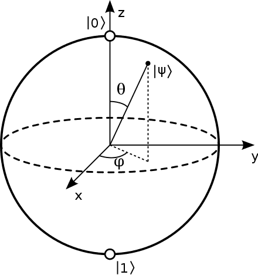
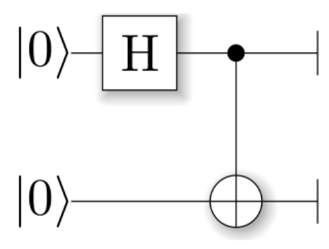

# Report

**2023 fall-compiler-H teamwork report**

## 选题和主要工作

**Quantum Programming Language**——量子编程语言及其特性语义分析

本项目旨在针对现有的量子编程语言进行调研和分析，主要包括以下工作步骤：

- 了解量子计算知识及量子编程语言发展现状
- 广泛调研现有量子编程语言（Cirq、SILQ、Qiskit、Q#、Quipper等）
- 分析各语言的功能和语义特性，对比各自对量子电路的实现方式；比较不同语言的优缺点
- 对SILQ语言进行详细分析
- 利用不同语言编写量子编程算法，体现语言特性和使用上的不同
- 分析当前量子编程语言存在的不足，提出可以改进的方向

## 组员分工及贡献比

| 姓名   | 学号       | 分工                                                         | 贡献比 |
| ------ | ---------- | ------------------------------------------------------------ | ------ |
| 杨宇航 | PB21051030 | 语言调研，深入分析Qiskit和Silq语言；使用部分调研的语言实现算法；提出对未来发展的探索 |        |
| 王彦彬 | PB21151765 | 语言调研，深入分析Q#和Silq语言；语言汇总及对比分析；提出对未来发展的探索 |        |
| 赵浩怡 | PB21111707 | 语言调研，深入分析Cirq和Quipper语言；语言汇总及对比分析；提出对未来发展的探索 |        |

## 量子计算和量子编程语言

### 量子比特和量子态叠加

比特是经典量子计算和量子信息中一个基本的概念。量子计算和量子信息同样建立在类似的概念量子比特(quantum bit或qubit)上，类似于经典比特可以处于0态或者1态，量子比特也有类似的态。

两个可能的量子态是$∣0⟩$和$ ∣1⟩$，他们类似于经典的比特0和1态。这里的$ ∣⟩$是物理学家喜欢用的狄拉克符号，后续介绍中默认使用这一套Dirac符号描述体系。

不同于经典比特的态信息，量子比特除了可以处于$ ∣0⟩$和$ ∣1⟩$状态，还可以处于$ ∣0⟩$和$ ∣1⟩$的线性叠加态，在物理学上，我们称之为量子叠加态：$∣ψ⟩=α∣0⟩+β∣1⟩$这里的 α和 β都是复数，且 $∣α∣^2+∣β∣^2=1$。

$∣0⟩$和$ ∣1⟩$是计算的基矢量。数学上，可以把量子比特在基矢量$ ∣0⟩$和$ ∣1⟩$下张成二维的复矢量。为了更加直观的区分量子比特和经典比特，可以把经典比特的0和1理解为地球的南北极，如图所示，而量子比特$ ∣ψ⟩$则可以是部分南极部分北极组成的叠加状态，此状态具有无限多可能性。

### 量子纠缠

实现一个复杂的量子计算机，必然需要涉及到复杂的多体量子体系。我们用直积⊗来描述两个量子体系组合成得复合量子体系，这个可以扩展到更多的量子体系。

以两个量子比特为例，对于量子态分别为$ ∣ψ1⟩$和$ ∣ψ2⟩$的两个量子比特，可以组成一个复合体系。有些态可以描述为$ ∣Ψ⟩=∣ψ1⟩∣ψ2⟩$的乘积态，或展开为:

$∣Ψ⟩=∣ψ1⟩⊗∣ψ2⟩=α1α2∣0⟩∣0⟩+α1β2∣0⟩∣1⟩+β1α2∣1⟩∣0⟩+β1β2∣1⟩∣1⟩$

我们默认量子比特坐标是从左到右分别为0,1,… 等。

两个直积形成的复合态$ ∣Ψ⟩$叫直积态(可分离态)。还有一种不能用两个直积生成的态，称为量子纠缠态，它无法分解为两个量子态的直积，如贝尔态：

$∣Ψ_{Bell}⟩=2^{-\frac{1}{2}}∣00⟩+2^{-\frac{1}{2}}∣11⟩$

量子纠缠作为重要的一种量子资源，广泛的应用在量子计算、量子通信中。

### 量子态演化和

在封闭体系中，一个量子态的演化可以用一个幺正变换来描述。一个$t_1$时刻的量子态$ ∣ψ(t1)⟩$通过一个幺正算符$U$(unitary operator)可以变换到$∣ψ(t2)⟩$, 这个幺正算符仅取决于时间$t_1$和$t_2$，$∣ψ(t2)⟩=U(t1,t2)∣ψ(t1)⟩$。

具体来说，一个封闭体系量子态的演化服从薛定谔方程$i\hbar \frac{\partial}{\partial t}|\psi\rangle = H|\psi\rangle$，其中ℏ是物理学中普朗克常数，$H$是系统的哈密顿量(Hamiltonian)。

即：一个量子体系，如果知道其初始态 $∣ψ_{t=0}⟩$, 以及Hamiltonian，则可以通过求解薛定谔方程知晓任意时刻态 $∣ψ_t⟩$。一般来说，类似于经典机器初始化，单量子比特的态会初始化在$ ∣0⟩$，即系统的初始化态一般是确定的，所以最重要的是构建系统的Hamiltonian。

### 量子门操作

从计算的角度，可以将Hamiltonian的演化分解成各种单比特和两比特量子门的组合。类比于经典计算机，从一些门集合（如或门，与门和非们）出发，可以通过组合，完成任意的经典计算过程。类似的，一系列复杂的量子计算也可以通过构建对应的复杂Hamiltonian来实现，即通过分解成一系列的量子门的组合来实现量子计算。理论计算表明，使用单比特门和两比特门CNOT集合可构成任意量子计算的复杂门。

常用的单量子比特门包括 Pauli 门 $X, Y, Z$ 和 Hadamard 门 $H$, 以及如下的 phase gate $S$ 和 $T$ 门，其对应的矩阵表示为：

$$
X = \begin{bmatrix}0 & 1\\1 & 0\end{bmatrix}, 
Y = \begin{bmatrix}0 & -i\\i & 0\end{bmatrix}, 
Z = \begin{bmatrix}1 & 0\\0 & -1\end{bmatrix},
$$

$$
H = \frac{1}{\sqrt{2}} \begin{bmatrix}1 & 1\\1 & -1\end{bmatrix}, 
S = \begin{bmatrix}1 & 0\\0 & i\end{bmatrix}, 
T = \begin{bmatrix}1 & 0\\0 & e^{i\pi/4}\end{bmatrix}.
$$

对于任意态的叠加，可以用下述方法表示一个量子比特的态：

$$
|\psi\rangle = \alpha|0\rangle + \beta|1\rangle
$$

一个X门可以对态进行翻转：
$$
X|\psi\rangle = 
\begin{bmatrix}
0 & 1 \\
1 & 0 \\
\end{bmatrix}
\begin{bmatrix}
\alpha \\
\beta \\
\end{bmatrix} 
= \beta|0\rangle + \alpha|1\rangle
$$

Hadamard门可以用于变换来制备叠加态和变换基矢：

$$
H|0\rangle = \frac{1}{\sqrt{2}}
\begin{bmatrix}
1 & 1\\
1 & -1\\
\end{bmatrix} 
[ 1, 0 ]^T = \frac{1}{2}(|0\rangle + |1\rangle)
$$

### 量子线路（电路）

与经典计算机类似，为了实现一个复杂的量子计算机计算过程，需要构造相应的量子电路。

**以Bell纠缠态的制备为例：**

Bell态的制备需要两个qubit，假设qubit的初态为

$$
∣ψ_0\rangle=|00⟩
$$

对$qubit1$施加一个Hadamard 门操作，此时复合系统的态为：

$\psi_1=\frac1{\sqrt2}(∣0⟩+∣1⟩)∣0⟩   =\frac1{\sqrt2}(∣00⟩+∣10⟩)$

然后以$qubit1$为控制比特，$qubit2$为目标比特，施加CNOT门，此时系统演化为：

$\psi_2=\frac1{\sqrt2}(∣00⟩+∣11⟩)$

这样，通过Hadamard门和CNOT门，就制备了一个Bell纠缠态。通过改变初态组合，可以制备其他额外3种Bell态。

纠缠表示的是一种非局域的关联关系。 对于$Φ^+$，理想情况下，如果 $qubit1 $测量结果为 0，则$qubit2 $的态也会塌缩到 0 态。如果$qubit1 $测量结果为 1，则$qubit2$也会塌缩到量子态 1 上。

在实验中，需要通过关联测量以及量子态层析来表示纠缠态。然而随着体系增大，表达量子态的矩阵元素指数增大，重构量子态在理论和实验上都比较难以操作，所以多体复杂体系的纠缠的度量目前还是一个很值得研究的话题。

### 量子编程语言

目前，大多量子编程语言仍处于基础的操纵量子比特的计算阶段，通过量子逻辑运算（NOT、CNOT）等改变量子比特的状态，再进行量测。Qiskit、Cirq等已有的量子编程语言都处于不断发展的阶段。

## 调研结果

### 总述

我们对目前开源的量子编程语言进行了调研，共较为详细调研了以下五种语言：Qiskit、SILQ、Cirq、Q#、Quipper，每个语言各自对应的调研报告见仓库，调研报告共计  字。

### 

## Silq

## 语言应用—实现算法

## 量子编程展望

正如前所说，目前量子编程语言仍处于基础的操纵量子比特的计算阶段，量子计算机的硬件和软件方面都面临许多挑战。

量子计算机的硬件问题主要包括：量子比特的稳定性、量子比特之间的耦合、量子比特的数量等；软件问题主要包括：量子编程语言不成熟、量子编译器不完善、量子算法的缺乏等。除此之外，由于缺少高效可用的量子芯片，为了能够验证高级量子编程语言的有效性以及新型量子线路优化算法的可靠性，还需要设计并实现量子计算仿真平台。