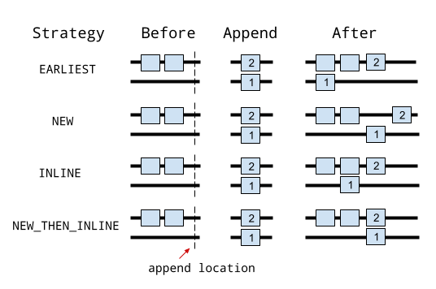

# Report

**2023 fall-compiler-H teamwork report**

## 选题和主要工作

**Quantum Programming Language**——量子编程语言及其特性语义分析

本项目旨在针对现有的量子编程语言进行调研和分析，主要包括以下工作步骤：

- 了解量子计算知识及量子编程语言发展现状
- 广泛调研现有量子编程语言（Cirq、SILQ、Qiskit、Q#、Quipper等）
- 分析各语言的功能和语义特性，对比各自对量子电路的实现方式；比较不同语言的优缺点
- 对SILQ语言进行详细分析
- 利用不同语言编写量子编程算法，体现语言特性和使用上的不同
- 分析当前量子编程语言存在的不足，提出可以改进的方向

## 组员分工及贡献比

| 姓名   | 学号       | 分工                                                         | 贡献比 |
| ------ | ---------- | ------------------------------------------------------------ | ------ |
| 杨宇航 | PB21051030 | 语言调研，深入分析Qiskit和Silq语言；使用部分调研的语言实现算法；提出对未来发展的探索 | 33%    |
| 王彦彬 | PB21151765 | 语言调研，深入分析Q#和Silq语言；语言汇总及对比分析；提出对未来发展的探索 | 33%    |
| 赵浩怡 | PB21111707 | 语言调研，深入分析Cirq和Quipper语言；语言汇总及对比分析；提出对未来发展的探索 | 33%    |

## 量子计算和量子编程语言

### 量子比特和量子态叠加

比特是经典量子计算和量子信息中一个基本的概念。量子计算和量子信息同样建立在类似的概念量子比特(quantum bit或qubit)上，类似于经典比特可以处于0态或者1态，量子比特也有类似的态。

两个可能的量子态是$∣0⟩$和$ ∣1⟩$，他们类似于经典的比特0和1态。这里的$ ∣⟩$是物理学家喜欢用的狄拉克符号，后续介绍中默认使用这一套Dirac符号描述体系。

不同于经典比特的态信息，量子比特除了可以处于$ ∣0⟩$和$ ∣1⟩$状态，还可以处于$ ∣0⟩$和$ ∣1⟩$的线性叠加态，在物理学上，我们称之为量子叠加态：$∣ψ⟩=α∣0⟩+β∣1⟩$这里的 α和 β都是复数，且 $∣α∣^2+∣β∣^2=1$。

$∣0⟩$和$ ∣1⟩$是计算的基矢量。数学上，可以把量子比特在基矢量$ ∣0⟩$和$ ∣1⟩$下张成二维的复矢量。为了更加直观的区分量子比特和经典比特，可以把经典比特的0和1理解为地球的南北极，如图所示，而量子比特$ ∣ψ⟩$则可以是部分南极部分北极组成的叠加状态，此状态具有无限多可能性。


### 量子纠缠

实现一个复杂的量子计算机，必然需要涉及到复杂的多体量子体系。我们用直积⊗来描述两个量子体系组合成得复合量子体系，这个可以扩展到更多的量子体系。

以两个量子比特为例，对于量子态分别为$ ∣ψ1⟩$和$ ∣ψ2⟩$的两个量子比特，可以组成一个复合体系。有些态可以描述为$ ∣Ψ⟩=∣ψ1⟩∣ψ2⟩$的乘积态，或展开为:

$∣Ψ⟩=∣ψ1⟩⊗∣ψ2⟩=α1α2∣0⟩∣0⟩+α1β2∣0⟩∣1⟩+β1α2∣1⟩∣0⟩+β1β2∣1⟩∣1⟩$

我们默认量子比特坐标是从左到右分别为0,1,… 等。

两个直积形成的复合态$ ∣Ψ⟩$叫直积态(可分离态)。还有一种不能用两个直积生成的态，称为量子纠缠态，它无法分解为两个量子态的直积，如贝尔态：

$∣Ψ_{Bell}⟩=2^{-\frac{1}{2}}∣00⟩+2^{-\frac{1}{2}}∣11⟩$

量子纠缠作为重要的一种量子资源，广泛的应用在量子计算、量子通信中。

### 量子态演化和

在封闭体系中，一个量子态的演化可以用一个幺正变换来描述。一个$t_1$时刻的量子态$ ∣ψ(t1)⟩$通过一个幺正算符$U$(unitary operator)可以变换到$∣ψ(t2)⟩$, 这个幺正算符仅取决于时间$t_1$和$t_2$，$∣ψ(t2)⟩=U(t1,t2)∣ψ(t1)⟩$。

具体来说，一个封闭体系量子态的演化服从薛定谔方程$i\hbar \frac{\partial}{\partial t}|\psi\rangle = H|\psi\rangle$，其中ℏ是物理学中普朗克常数，$H$是系统的哈密顿量(Hamiltonian)。

即：一个量子体系，如果知道其初始态 $∣ψ_{t=0}⟩$, 以及Hamiltonian，则可以通过求解薛定谔方程知晓任意时刻态 $∣ψ_t⟩$。一般来说，类似于经典机器初始化，单量子比特的态会初始化在$ ∣0⟩$，即系统的初始化态一般是确定的，所以最重要的是构建系统的Hamiltonian。

### 量子门操作

从计算的角度，可以将Hamiltonian的演化分解成各种单比特和两比特量子门的组合。类比于经典计算机，从一些门集合（如或门，与门和非们）出发，可以通过组合，完成任意的经典计算过程。类似的，一系列复杂的量子计算也可以通过构建对应的复杂Hamiltonian来实现，即通过分解成一系列的量子门的组合来实现量子计算。理论计算表明，使用单比特门和两比特门CNOT集合可构成任意量子计算的复杂门。

常用的单量子比特门包括 Pauli 门 $X, Y, Z$ 和 Hadamard 门 $H$, 以及如下的 phase gate $S$ 和 $T$ 门，其对应的矩阵表示为：

$$
X = \begin{bmatrix}0 & 1\\1 & 0\end{bmatrix}, 
Y = \begin{bmatrix}0 & -i\\i & 0\end{bmatrix}, 
Z = \begin{bmatrix}1 & 0\\0 & -1\end{bmatrix},
$$

$$
H = \frac{1}{\sqrt{2}} \begin{bmatrix}1 & 1\\1 & -1\end{bmatrix}, 
S = \begin{bmatrix}1 & 0\\0 & i\end{bmatrix}, 
T = \begin{bmatrix}1 & 0\\0 & e^{i\pi/4}\end{bmatrix}.
$$

对于任意态的叠加，可以用下述方法表示一个量子比特的态：

$$
|\psi\rangle = \alpha|0\rangle + \beta|1\rangle
$$

一个X门可以对态进行翻转：
$$
X|\psi\rangle = 
\begin{bmatrix}
0 & 1 \\
1 & 0 \\
\end{bmatrix}
\begin{bmatrix}
\alpha \\
\beta \\
\end{bmatrix} 
= \beta|0\rangle + \alpha|1\rangle
$$

Hadamard门可以用于变换来制备叠加态和变换基矢：

$$
H|0\rangle = \frac{1}{\sqrt{2}}
\begin{bmatrix}
1 & 1\\
1 & -1\\
\end{bmatrix} 
[ 1, 0 ]^T = \frac{1}{2}(|0\rangle + |1\rangle)
$$

### 量子线路（电路）

与经典计算机类似，为了实现一个复杂的量子计算机计算过程，需要构造相应的量子电路。

**以Bell纠缠态的制备为例：**

Bell态的制备需要两个qubit，假设qubit的初态为

$$
∣ψ_0\rangle=|00⟩
$$


对$qubit1$施加一个Hadamard 门操作，此时复合系统的态为：

$\psi_1=\frac1{\sqrt2}(∣0⟩+∣1⟩)∣0⟩   =\frac1{\sqrt2}(∣00⟩+∣10⟩)$

然后以$qubit1$为控制比特，$qubit2$为目标比特，施加CNOT门，此时系统演化为：

$\psi_2=\frac1{\sqrt2}(∣00⟩+∣11⟩)$

这样，通过Hadamard门和CNOT门，就制备了一个Bell纠缠态。通过改变初态组合，可以制备其他额外3种Bell态。

纠缠表示的是一种非局域的关联关系。 对于$Φ^+$，理想情况下，如果 $qubit1 $测量结果为 0，则$qubit2 $的态也会塌缩到 0 态。如果$qubit1 $测量结果为 1，则$qubit2$也会塌缩到量子态 1 上。

在实验中，需要通过关联测量以及量子态层析来表示纠缠态。然而随着体系增大，表达量子态的矩阵元素指数增大，重构量子态在理论和实验上都比较难以操作，所以多体复杂体系的纠缠的度量目前还是一个很值得研究的话题。

### 量子编程语言

目前，大多量子编程语言仍处于基础的操纵量子比特的计算阶段，通过量子逻辑运算（NOT、CNOT）等改变量子比特的状态，再进行量测。Qiskit、Cirq等已有的量子编程语言都处于不断发展的阶段。

## 调研结果

### 总述

我们对目前开源的量子编程语言进行了调研，共较为详细调研了以下五种语言：Qiskit、Silq、Cirq、Q#、Quipper，每个语言各自对应的调研报告见仓库，调研报告共计3万字左右。对结果进行汇总分析如下。

### Qiskit

Qiskit由 IBM 团队开发的开源量子计算框架，用于构建和执行量子程序。它提供了一系列工具、库和 API，使用户能够与 IBM 的量子计算机进行交互，并进行量子算法开发和量子模拟。

### Silq

Silq是由苏黎世联邦理工学院（ETH Zurich）的研究人员开发的量子编程语言，专注于简化经典和量子计算之间的转换，并提供了一些高级特性，如自动量子门优化和动态内存管理。

### Cirq

Cirq是由 Google 开发的开源量子计算库，用于在量子计算机上设计、测试和运行量子算法。Cirq 提供了丰富的数据结构和算法，使用户能够直接操作量子比特和量子门。

### Q#

Q#是由微软开发的一种专门用于量子计算的编程语言。它具有丰富的库和工具，用于开发和调试量子算法。Q# 支持与经典计算机进行交互，并提供了与 Microsoft Quantum Development Kit 配套使用的开发环境。

### Quipper

Quipper由Oxford大学的Peter Shor等人于2013年开发的一种高级量子计算编程语言。它使用一种基于线路图和电路图的编程模型，可以方便的描述和模拟量子算法和量子计算机。支持量子态操作、量子算法设计和量子模拟等。

### 语言特性对比分析

#### 量子比特

量子比特是量子计算的基本单元，与经典比特只能表示0或1的状态不同，量子比特可以处于叠加态，即同时表示0和1的线性组合，系数表示测量时各个状态的测量概率。

##### Silq

Silq包含完整的经典类型框架，同时使用标识符`!`附加到经典类型之前来代表量子类型，比如`!B`就代表量子比特的类型。

Silq支持多种灵活的初始化方式，不仅可以实现对单个量子比特的初始化，也可以支持对由量子比特组成的向量/数组进行初始化，并且允许在静态类型转换的条件下重新定义变量类型，或者使用`as`安全类型转换在特定的变量之间进行类型转换。

以下是Silq的一个变量初始化和赋值的实例：

```javascript
  a:=0:!𝔹; // 经典比特，值为0
  b:=a:𝔹; // 量子比特，状态为0
  c:=0:uint[3]; // 3比特量子无符号数，状态为000
  d:=vector(4,false):𝔹[]; // 4比特量子向量
```

##### ###### Q#

定义单个量子比特：

```C++
use q = Qubit();
```

分配多个量子比特，并通过其索引访问每个量子比特：

```C++
use qubits = Qubit[2];
X(qubits[1]);
H(qubits[0]);
```

默认情况下，使用 `use` 关键字分配的每个量子位最初都为 0 态。 在程序结束时释放每个量子比特之前， **必须** 重置回零状态。 未能重置量子比特将触发运行时错误。

##### Quipper

- 数据类型

  - data Qubit 量子比特
  - data Bit 经典比特
  - type Qulist 量子比特列表
  - type Bitlist 经典比特列表

- 初始化方法

  - 支持用bool型值（True/False）初始化和字符型值（0、1、+、-）

    - bool型：qinit_plusminus :: Bool -> Circ Qubit
    - 字符型：qinit_of_char :: Char -> Circ Qubit

  - 支持对单个比特初始化

  - 支持初始化比特序列（生成list类型）

    qinit_of_string :: String -> Circ Qubit

##### Cirq

相比于真正的量子比特，cirq中的量子比特没有任何状态，其实际状态保持在量子处理器或模拟状态向量中。

- 定义方法

  Cirq有三种定义量子比特的主要方法

  - `cirq.NamedQubit`：用抽象名称标记量子比特，可以用于抽象算法，以及还没有映射到硬件的算法；如：

    ```python
    q0 = cirq.NamedQubit('source')
    q1 = cirq.NamedQubit('target'
    ```

  - `cirq.LineQubit`：在线性阵列中用数字标记的量子比特，如：

    - 单独定义：

      ```python
      q3 = cirq.LineQubit(3)
      ```

    - 在一个范围中定义：

      ```python
      q0, q1, q2 = cirq.LineQubit.range(3)
      #创建LineQubit(0),LineQubit(1), LineQubit(2)
      ```

  - `cirq.GridQubit`：在矩形晶格中由两个数字标记的量子比特

    - 单独定义：

      ```python
      q4_5 = cirq.GridQubit(4, 5)
      ```

    - 在矩阵中批量定义：

      ```python
      qubits = cirq.GridQubit.square(4)
      # 创建16个量子比特，从(0,0)到(3,3)
      ```

#### 量子门

与经典计算机类似，为了实现一个复杂的量子计算机计算过程，我们需要构造相应的量子电路。而电路是通过各种量子门的组合实现的。

理论计算已经证明，使用单比特量子门和两比特门CNOT的集合可构成任意量子计算的复杂门，这是量子计算的基础。

##### Silq

Silq将量子门直接集成为函数来使用，下面是一些常见的量子门/测量对应的Silq函数以及其类型，可以方便地在代码中组合，形成量子编程门阵列。

| Function: Type                 | Explanation                                                  |
| ------------------------------ | ------------------------------------------------------------ |
| `measure: τ→!τ`                | 对量子态进行测量                                             |
| `H:𝔹→mfree 𝔹`                  | Hadamard门                                                   |
| `phase:!ℝ→mfree 𝟙`             | `phase`指的是一个量子态的相位，相位是一个复数。`phase(r)`操作会将当前量子态的相位乘以$e^{ir}$，改变相位，但不改变量子态概率幅度。phase只有在量子条件语句中执行时才会有可观察的效果，单独的相位变化不可观察，只有当两个量子态的相位差发生变化时，才能通过干涉效应观察到相位的变化。 |
| `rotX:!ℝ×𝔹→mfree 𝔹`            | eir`rotX(r,b)` 返回 `b:𝔹` 绕x轴旋转 `r:!ℝ`                   |
| `rotY:!ℝ×𝔹→mfree 𝔹`            | `rotY(r,b)` 返回 `b:𝔹` 绕`y`轴旋转 `r:!ℝ`                    |
| `rotZ:!ℝ×𝔹→mfree 𝔹`            | `rotZ(r,b)` 返回 `b:𝔹` 绕`z`轴旋转 `r:!ℝ`                    |
| `X:𝔹→qfree 𝔹`                  | `X(b)` 返回比特翻转：$|b\rangle \rightarrow|1-b\rangle$      |
| `Y:𝔹→mfree 𝔹`                  | `Y(b)` 返回 `b` 经过 `Y`门的结果: $|b\rangle\rightarrow i(-1)^b|1-b\rangle$ |
| `Z:𝔹→mfree 𝔹`                  | `Z(b)` 返回 `b` 经过 `Z`门的结果: $|b\rangle\rightarrow(-1)^b|b\rangle$ |
| `dup:const τ→qfree τ`          | `dup(v)`返回`v`的复制 `v`: $|v⟩↦|v⟩|v⟩$                      |
| `array:!ℕ×const τ×→qfree τ[]`  | `vector(m,v)` 返回一个由m个 `v`的复制组成的数组              |
| `vector:!ℕ×const τ×→qfree τ^n` | `vector(m,v)` 返回一个由m个 `v`的复制组成的向量              |

##### Q#

Q#中调用量子门与Silq十分类似，将量子门集成为操作(Operation)，以下是两个十分简单的例子：

使用Handmard门：

```C++
H(q);
```

CNOT 是两比特门，控制比特left为1时，目标比特right的状态进行翻转，控制比特为0时，目标比特right的状态不变：

```C++
CNOT(left, right);
```

##### Quipper

- 对于常见的基本门，Quipper提供了两种门的实现形式，分别是函数式可逆门和命令式可逆门。

  区别在于：

  - 函数式可逆门有返回值，如：

    qnot`门输入一个`Qubit`，对其执行一个操作，输出一个新的`Qubit`，使用方式如下：

    ```
    output <- qnot input
    ```

    二元门：

    ```
    (out0, out1) <- gate_W in0 in1
    ```

  - 命令式可逆门没有返回值，而是对量子比特进行“就地”运算，如：

    ```
    qnot_at q
    ```

    对二元门：

    ```
    gate_W_at q0 q1
    ```

- Quipper提供经典电路的门，用于构建经典电路，不改变或丢弃其输入，每个门产生一个包含输出值的wire，如：

  - `cgate_eq :: Bit -> Bit -> Circ Bit`: 测试两个比特是否相等，相等返回True。

  - `cgate_not :: Bit -> Circ Bit`: 返回输入的否定

    与`cnot`/`cnot_at`不同：该操作不改变输入，而是为输出创建一个新的比特。

- Quipper支持用户自定义门

  - `named_gate :: QData qa => String -> qa -> Circ qa`

    定义给定名称的新函数式门，用法：

    - 定义新的一元门Q：

    ```
    my_unary_gate :: Qubit -> Circ Qubit
    my_unary_gate = named_gate "Q"
    ```

    - 定义新的二元门R：

    ```
    my_binary_gate :: (Qubit, Qubit) -> Circ (Qubit, Qubit)
    my_binary_gate = named_gate "R"
    ```

  - `named_gate_at :: QData qa => String -> qa -> Circ ()`

    定义给定名称的命令式门，用法：

    - 定义新的一元门Q：

    ```
    my_unary_gate_at :: Qubit -> Circ ()
    my_unary_gate_at = named_gate_at "Q"
    ```

    - 定义新的二元门R：

    ```
    my_binary_gate_at :: (Qubit, Qubit) -> Circ ()
    my_binary_gate_at = named_gate_at "R"
    ```

  - `named_rotation :: QData qa => String -> Timestep -> qa -> Circ qa`

    定义给定名称的新的函数式门，并以实值参数参数化。常用于按角度参数化的旋转或相位门。名称中可以用`%`作为参数的占位符。用法如下：

    ```
    my_unary_gate :: Qubit -> Circ Qubit
    my_unary_gate = named_rotation "exp(-i%Z)" 0.123
    ```

    ```
    my_binary_gate :: TimeStep -> (Qubit, Qubit) -> Circ (Qubit, Qubit)
    my_binary_gate t = named_rotation "Q(%)" t
    ```

  - `named_rotation_at :: QData qa => String -> Timestep -> qa -> Circ ()`

    定义给定名称的新的命令式门，并以实值参数参数化。使用方法类似函数式门。

    ```
    my_unary_gate_at :: Qubit -> Circ ()
    my_unary_gate_at = named_rotation "exp(-i%Z)" 0.123
    ```

    ```
    my_binary_gate_at :: TimeStep -> (Qubit, Qubit) -> Circ ()
    my_binary_gate_at t = named_rotation "Q(%)" t
    ```

  - `extended_named_gate :: (QData qa, QData qb) => String -> qa -> qb -> Circ qa`

    定义新函数式门，和`named_gate`类似，只是生成的门用`generalized controls`扩展。`generalized controls`是门的其他输入，如果他们处于计算基状态则一定不会被修改。在电路图中以特殊方式呈现。用法如下：

    ```
    my_new_gate :: (Qubit,Qubit) -> Qubit -> Circ (Qubit,Qubit)
    my_new_gate = extended_named_gate "Q"
    ```

    定义了一个新的门Q，有两个输入和一个`generalized`输入。

  - `extended_named_gate_at :: (QData qa, QData qb) => String -> qa -> qb -> Circ ()`

    上一定义的命令形式，用法如下：

    ```
    my_new_gate_at :: (Qubit,Qubit) -> Qubit -> Circ ()
    my_new_gate_at = extended_named_gate_at "Q"
    ```

##### Cirq

`cirq.gate`可以应用于一个或多个量子比特，可以通过`gate.on(*qubits)`或`gate(*qubits)`实现。这样会将一个`cirq.Gate` 转化为一个 `cirq.Operation`。

如：`cirq.H`是一个对象，`Gate cirq.H(cirq.LineQubit(1)) Operation`是应用于特定量子比特（行量子比特数1）的Hadamard矩阵门。

代码示例1：

```python
# This is a Pauli X gate. It is an object instance.
x_gate = cirq.X
# Applying it to the qubit at location (0, 0) (defined above)
# turns it into an operation.
x_op = x_gate(qubits[0])
print(x_op)
```

```
X(q(0, 0))
```

代码示例2：

```python
cnot_gate = cirq.CNOT
pauli_z = cirq.Z

# Use exponentiation to get square root gates.
sqrt_x_gate = cirq.X**0.5

# Some gates can also take parameters
sqrt_sqrt_y = cirq.YPowGate(exponent=0.25)

# Create two qubits at once, in a line.
q0, q1 = cirq.LineQubit.range(2)

# Example operations
z_op = cirq.Z(q0)
not_op = cirq.CNOT(q0, q1)
sqrt_iswap_op = cirq.SQRT_ISWAP(q0, q1)

# Use the gates you specified earlier.
cnot_op = cnot_gate(q0, q1)
pauli_z_op = pauli_z(q0)
sqrt_x_op = sqrt_x_gate(q0)
sqrt_sqrt_y_op = sqrt_sqrt_y(q0)
```

#### 量子电路

##### 电路构建于电路操作

##### Quipper

**Reversing**

- reverse_generic :: (QCData x, QCData y, TupleOrUnary xt x, QCurry x_y x y, Curry x_y_xt x (y -> Circ xt)) => x_y -> x_y_xt

  反转电路生成的函数，反转后的函数需要一个形状参数，该形状参数是原始函数的输入类型。

  这个高度重载的函数的类型很难阅读。例如，它可以具有以下类型：

  ```
  reverse_generic :: (QCData x, QCData y) => (x -> Circ y) -> x -> (y -> Circ x) 
  reverse_generic :: (QCData x, QCData y, QCData z) => (x -> y -> Circ z) -> x -> y -> (z -> Circ (x,y)) 
  ```

- reverse_simple :: (QCData_Simple x, QCData y, TupleOrUnary xt x, QCurry x_y x y) => x_y -> y -> Circ xt

  类似于reverse_generic，但仅适用于简单类型，因此不需要形状参数。典型实例：

  ```
  reverse_simple :: (QCData_Simple x, QCData y) => (x -> Circ y) -> (y -> Circ x)
  reverse_simple :: (QCData_Simple x, QCData_Simple y, QCData z) => (x -> y -> Circ z) -> (z -> Circ (x,y))
  ```

- reverse_generic_endo :: (QCData x, TupleOrUnary xt x, QCurry x_xt x xt) => x_xt -> x_xt

  类似于reverse_generic，但专门适用于端态电路（endomorphic circuits），即输入和输出具有相同类型（可能通过柯里化）和形状的电路。与reverse_generic不同，它不需要附加的形状参数，并且反转函数如果原始函数是柯里化的，则也是柯里化的。典型实例：

  ```
  reverse_generic_endo :: (QCData x) => (x -> Circ x) -> (x -> Circ x)
  reverse_generic_endo :: (QCData x, QCData y) => (x -> y -> Circ (x,y)) -> (x -> y -> Circ (x,y))
  ```

- reverse_generic_imp :: (QCData x, QCurry x__ x ()) => x__ -> x__

  类似于reverse_generic_endo，但适用于以命令式风格表达的端态电路。典型实例：

  ```
  reverse_generic_endo :: (QCData x) => (x -> Circ ()) -> (x -> Circ ())
  reverse_generic_endo :: (QCData x, QCData y) => (x -> y -> Circ ()) -> (x -> y -> Circ ())
  ```

- reverse_generic_curried :: (QCData x, QCData y, TupleOrUnary xt x, Tuple yt y, QCurry x_yt x yt, QCurry y_xt y xt, Curry x_y_xt x y_xt) => x_yt -> x_y_xt

  类似于reverse_generic，但接受输出为元组的函数，并对反转函数进行柯里化。下面的例子说明与reverse_generic的区别：

  ```
  f                         :: (x -> y -> Circ (z,w))
  reverse_generic f         :: x -> y -> ((z,w) -> Circ (x,y))
  reverse_generic_curried f :: x -> y -> (z -> w -> Circ (x,y))
  ```

  注意：输出必须是n元组，其中n = 0或n ≥ 2。将其应用于输出为非元组类型的电路是类型错误的；在这种情况下，应使用reverse_generic。

- reverse_simple_curried :: (QCData_Simple x, QCData y, TupleOrUnary xt x, Tuple yt y, QCurry x_yt x yt, QCurry y_xt y xt) => x_yt -> y_xt

  类似于reverse_simple，但接受输出为元组的函数，并对反转函数进行柯里化。

- reverse_endo_if :: (QCData x, TupleOrUnary xt x, QCurry x_xt x xt) => Bool -> x_xt -> x_xt

  `reverse_generic_endo`的条件版本。根据一个布尔值的真假来选择是否反转端态（endomorphic）量子电路。如果布尔值为true，则反转电路；否则，插入非反转的电路。

- reverse_imp_if :: (QCData qa, QCurry fun qa ()) => Bool -> fun -> fun

  `reverse_generic_imp`的条件版本。根据一个布尔值的真假来选择是否反转以命令式风格表达的量子电路。如果布尔值为true，则反转电路；否则，插入非反转的电路。

  这两个函数提供了根据条件选择是否反转电路的能力。

**Classical circuits**

以下函数可以用于在经典电路和量子电路之间进行转换。

- classical_to_cnot :: (QCData qa, QCData qb, QCurry qfun qa qb) => qfun -> qfun

  将电路中的所有经典门转换为等效的控制非门（controlled-not gates）。

  更易读的形式：

  ```
  classical_to_cnot :: (QCData qa) => Circ qa -> Circ qa
  classical_to_cnot :: (QCData qa, QCData qb) => (qa -> Circ qb) -> (qa -> Circ qb)
  classical_to_cnot :: (QCData qa, QCData qb, QCData qc) => (qa -> qb -> Circ qc) -> (qa -> qb -> Circ qc)
  ```

- classical_to_quantum :: (QCData qa, QCData qb, QCurry qfun qa qb, QCurry qfun' (QType qa) (QType qb)) => qfun -> qfun'

  用等效的量子门替换电路中的所有经典门。

  更易读的形式：

  ```
  classical_to_quantum :: (QCData qa) => Circ qa -> Circ (QType qa)
  classical_to_quantum :: (QCData qa, QCData qb) => (qa -> Circ qb) -> (QType qa -> Circ (QType qb))
  classical_to_quantum :: (QCData qa, QCData qb, QCData qc) => (qa -> qb -> Circ qc) -> (QType qa -> QType qb -> Circ (QType qc))
  ```

**Ancilla uncomputation**

- classical_to_reversible :: (QCData qa, QCData qb) => (qa -> Circ qb) -> (qa, qb) -> Circ (qa, qb)

  将经典（或伪经典）电路转换为可逆电路的通用函数。输入是一个经典布尔函数 x ↦ f(x)，以非必须可逆的电路形式给出（但是，电路应该是一对一的，即不应明确擦除任何“垃圾”）。输出是相应的可逆函数 (x,y) ↦ (x,y ⊕ f(x))。qa和qb可以是任何量子数据类型。函数classical_to_reversible本身不会将经典位转换为量子比特；可以使用classical_to_quantum进行转换。

**Circuit transformers**

转换器是定义电路映射的一种非常通用的方式。可能的用途包括：

- 门变换，整个电路通过将每种类型的门替换为另一个门或电路来进行转换；
- 错误纠正编码，整个电路通过将每个比特替换为一些固定数量的比特，并将每个门替换为电路来进行转换
- 模拟，整个电路通过为每个门指定一个语义函数将其映射到语义函数。

Quipper中要定义特定的转换，程序员只需指定三个信息：

- type a=Qubit和 b=Bit，作为语义域。

- A Monad m，从而允许翻译具有副作用（如果需要的话）；否则可以使用Identity Monad。

- 对于每个门G，对应的语义函数G。此函数的类型取决于门G的类型。例如：

  ```
  If G :: Qubit -> Circ Qubit, then G :: a -> m a. 
  If G :: (Qubit, Bit) -> Circ (Bit, Bit), then G :: (a, b) -> m (b, b).
  ```

程序员通过定义类型为Transformer m a b的函数来提供这些信息，一旦定义了特定的转换器，就可以将其应用于整个电路。例如，对于具有1个输入和2个输出的电路：

```
If C :: Qubit -> (Qubit, Qubit), then C :: a -> m (a, a).
```

Quipper中支持用户自定义转换器和使用已定义的转换器。

**Automatic circuit generation from classical code**

`Quipper.Internal.CircLifting`和`Quipper.Utils.Template`两个模块提供从经典代码自动生成电路的功能。

##### Cirq

**电路层次结构**

Cirq中量子程序的主要表示形式是`Clircuit`类。Cirq中的电路采用分层思想实现，如下图所示。


其分层结构依据量子比特的概念，从低到高依次为：

- 量子比特（由基类cirq.Qid标识）

- 量子门（cirq.gate），cirq中量子门作用于量子比特则使其被转化为操作（cirq.operation）。

- Moment：`Operations`的集合，这些操作在同一个抽象时间片内起作用；每个`operation`必须作用于一组不相交的量子比特。`Moment`可以看作一个量子电路的垂直切片。

  ```python
  cz = cirq.CZ(qubits[0], qubits[1])
  x = cirq.X(qubits[2])
  moment = cirq.Moment(x, cz)
  
  print(moment)
  ```

  ```python
  ╷ 0 1 2
  ╶─┼───────
  0 │ @─@ X
    │
  ```

- 电路（Circuit）：`Moments`的集合，其中的第一个`Moment`包含将被应用的第一个`Operation`。

**电路构建**

电路可以通过不同方式构建。

- 使用Circuit.append方法

  将一个新的时刻添加到量子比特：

  ```python
  q0, q1, q2 = [cirq.GridQubit(i, 0) for i in range(3)]
  circuit = cirq.Circuit()
  circuit.append([cirq.CZ(q0, q1), cirq.H(q2)])
  
  print(circuit)
  ```

  ```
  (0, 0): ───@───
             │
  (1, 0): ───@───
  
  (2, 0): ───H───
  ```

  继续执行下列操作将添加完整时刻：

  ```python
  circuit.append([cirq.H(q0), cirq.CZ(q1, q2)])
  print(circuit)
  ```

  ```
  (0, 0): ───@───H───
             │
  (1, 0): ───@───@───
                 │
  (2, 0): ───H───@───
  ```

  上述操作也可以一次完成：

  ```python
  circuit = cirq.Circuit()
  circuit.append([cirq.CZ(q0, q1), cirq.H(q2), cirq.H(q0), cirq.CZ(q1, q2)])
  
  print(circuit)
  ```

  将得到相同结果。

- 插入策略

  `cirq.InsertStrategy`定义给定指定位置时如何把`Operations`插入到`Circuit`中。这里位置由`Moment`在`circuit`中的索引定义。

  有四种插入策略：

  - [`InsertStrategy.EARLIEST`](https://quantumai.google/reference/python/cirq/InsertStrategy#EARLIEST)（默认）：

    从插入位置向后扫描，直到找到操作触及受插入操作影响的量子比特的时刻。该操作将添加到该位置之后的时刻。

    示例1：`Operation`被插入到第一个`Moment`

    ```python
    from cirq.circuits import InsertStrategy
    
    circuit = cirq.Circuit()
    circuit.append([cirq.CZ(q0, q1)])
    circuit.append([cirq.H(q0), cirq.H(q2)], strategy=InsertStrategy.EARLIEST)
    
    print(circuit)
    ```

    ```
    (0, 0): ───@───H───
               │
    (1, 0): ───@───────
    
    (2, 0): ───H───────
    ```

    示例2：

    所有Hadamard门都尽可能向左推，只要没有重叠就放入同一`Moment`。若将操作应用于相同量子比特，则他们会按插入顺序的序列处理。在下面的示例中，两个量子比特门重叠，被放置在连续的时刻中。

    ```python
    print(cirq.Circuit(cirq.SWAP(q, q + 1) for q in cirq.LineQubit.range(3)))
    ```

    ```
    0: ───×───────────
          │
    1: ───×───×───────
              │
    2: ───────×───×───
                  │
    3: ───────────×───
    ```

  - [`InsertStrategy.NEW`](https://quantumai.google/reference/python/cirq/InsertStrategy#NEW)

    插入的每个操作都在新的moment创建。在不希望插入的操作干扰其他操作时尤其有效。

    示例：

    ```python
    circuit = cirq.Circuit()
    circuit.append([cirq.H(q0), cirq.H(q1), cirq.H(q2)], strategy=InsertStrategy.NEW)
    
    print(circuit)
    ```

    ```
    (0, 0): ───H───────────
    
    (1, 0): ───────H───────
    
    (2, 0): ───────────H───
    ```

  - [`InsertStrategy.INLINE`](https://quantumai.google/reference/python/cirq/InsertStrategy#INLINE)：

    尝试将要插入的操作添加到所需插入位置之前的点。但是，如果已经存在影响要插入的操作所触及的任何量子比特的现有操作，则会创建一个新时刻。

    示例：

    ```python
    circuit = cirq.Circuit()
    circuit.append([cirq.CZ(q1, q2)])
    circuit.append([cirq.CZ(q1, q2)])
    circuit.append([cirq.H(q0), cirq.H(q1), cirq.H(q2)], strategy=InsertStrategy.INLINE)
    
    print(circuit)
    ```

    ```
    (0, 0): ───────H───────
    
    (1, 0): ───@───@───H───
               │   │
    (2, 0): ───@───@───H───
    ```

  - and [`InsertStrategy.NEW_THEN_INLINE`](https://quantumai.google/reference/python/cirq/InsertStrategy#NEW_THEN_INLINE)：

    在第一个操作所需的插入位置处创建一个新的moment，然后根据`InsertStrategy.INLINE`插入。

    示例：

    ```python
    circuit = cirq.Circuit()
    circuit.append([cirq.H(q0)])
    circuit.append([cirq.CZ(q1, q2), cirq.H(q0)], strategy=InsertStrategy.NEW_THEN_INLINE)
    
    print(circuit)
    ```

    ```
    (0, 0): ───H───H───
    
    (1, 0): ───────@───
                   │
    (2, 0): ───────@───
    ```

  **不同插入策略的图示**
  

- 电路切片和迭代

  电路可以迭代和切片。

  **迭代**

  当它们被迭代时，迭代中的每个项目都是一个moment：

  ```python
  circuit = cirq.Circuit(cirq.H(q0), cirq.CZ(q0, q1))
  for moment in circuit:
      print(moment)
  ```

  ```
    ╷ 0
  ╶─┼───
  0 │ H
    │
    ╷ 0
  ╶─┼───
  0 │ @
    │ │
  1 │ @
    │
  ```

  **切片**

  当circuit被切片时，会生成一个只有与切片对应moments的新的circuit

  示例：

  ```python
  circuit = cirq.Circuit(cirq.H(q0), cirq.CZ(q0, q1), cirq.H(q1), cirq.CZ(q0, q1))
  print(circuit[1:3])
  ```

  ```
  (0, 0): ───@───────
             │
  (1, 0): ───@───H───
  ```

  **应用：**

  - 丢弃最后一个moment：`circuit[:-1]`
  - 反转电路：`circuit[::-1]`

- 嵌套电路

  电路可以使用`cirq.CircuitOperation`彼此嵌套，这对于简明扼要地定义大型重复电路很有用。需要序列化的电路尤其受益于这一点，因为在电路的 Python 构造中使用的循环和函数不会在序列化中捕获。

  **使用方法：**

  子电路必须首先被“冻结”，以表明不会对其进行进一步的更改。

  ```python
  subcircuit = cirq.Circuit(cirq.H(q1), cirq.CZ(q0, q1), cirq.CZ(q2, q1), cirq.H(q1))
  subcircuit_op = cirq.CircuitOperation(subcircuit.freeze())
  circuit = cirq.Circuit(cirq.H(q0), cirq.H(q2), subcircuit_op)
  print(circuit)
  ```

  ```
  [ (0, 0): ───────@─────────── ]
                 [                │            ]
  (0, 0): ───H───[ (1, 0): ───H───@───@───H─── ]───
                 [                    │        ]
                 [ (2, 0): ───────────@─────── ]
                 │
  (1, 0): ───────#2────────────────────────────────
                 │
  (2, 0): ───H───#3────────────────────────────────
  ```

  也可以直接构建冻结电路：

  ```python
  circuit = cirq.Circuit(
      cirq.CircuitOperation(
          cirq.FrozenCircuit(cirq.H(q1), cirq.CZ(q0, q1), cirq.CZ(q2, q1), cirq.H(q1))
      )
  )
  print(circuit)
  ```

   `CircuitOperation`类似一个函数：默认情况下，它的行为类似于它所包含的电路，但可以向它传递参数，以改变它操作的量子比特、重复的次数和其他属性。简洁起见，也可以在同一“外部”电路中多次引用`CircuitOperation`s。

  ```python
  subcircuit_op = cirq.CircuitOperation(cirq.FrozenCircuit(cirq.CZ(q0, q1)))
  
  # Create a copy of subcircuit_op that repeats twice...
  repeated_subcircuit_op = subcircuit_op.repeat(2)
  
  # ...and another copy that replaces q0 with q2 to perform CZ(q2, q1).
  moved_subcircuit_op = subcircuit_op.with_qubit_mapping({q0: q2})
  circuit = cirq.Circuit(repeated_subcircuit_op, moved_subcircuit_op)
  print(circuit)
  ```

  ```
  [ (0, 0): ───@─── ]
  (0, 0): ───[            │    ]────────────────────────────────────────────────────────────────
             [ (1, 0): ───@─── ](loops=2)
             │
  (1, 0): ───#2─────────────────────────────#2──────────────────────────────────────────────────
                                            │
                                            [ (0, 0): ───@─── ]
  (2, 0): ──────────────────────────────────[            │    ]─────────────────────────────────
                                            [ (1, 0): ───@─── ](qubit_map={q(0, 0): q(2, 0)})
  ```

  大多数情况下，`CircuitOperation`的行为和一般操作一样：只是它的量子比特包含circuit，它可以放置在任何尚未包含这些量子比特操作的`Moment`中。因此， `CircuitOperation`s 可以用于表示更复杂的操作时序，例如在一个量子比特上并行执行三个操作，在另一个量子比特上并行执行两个操作：

  ```python
  subcircuit_op = cirq.CircuitOperation(cirq.FrozenCircuit(cirq.H(q0)))
  circuit = cirq.Circuit(
      subcircuit_op.repeat(3), subcircuit_op.repeat(2).with_qubit_mapping({q0: q1})
  )
  print(circuit)
  ```

  ```
  (0, 0): ───[ (0, 0): ───H─── ](loops=3)─────────────────────────────────
  
  (1, 0): ───[ (0, 0): ───H─── ](qubit_map={q(0, 0): q(1, 0)}, loops=2)───
  ```

  `CircuitOperation`s 也可以嵌套在彼此内部，达到任意深度：

  ```python
  qft_1 = cirq.CircuitOperation(cirq.FrozenCircuit(cirq.H(q0)))
  qft_2 = cirq.CircuitOperation(cirq.FrozenCircuit(cirq.H(q1), cirq.CZ(q0, q1) ** 0.5, qft_1))
  qft_3 = cirq.CircuitOperation(
      cirq.FrozenCircuit(cirq.H(q2), cirq.CZ(q1, q2) ** 0.5, cirq.CZ(q0, q2) ** 0.25, qft_2)
  )
  # etc.
  ```

  最后，`mapped_circuit`将在所有重复和重新映射后返回 `CircuitOperation`表示的电路。默认情况下，只“展开”一层 `CircuitOperation`，可以通过设置`deep=True`递归展开所有层。

  ```python
  # A large CircuitOperation with other sub-CircuitOperations.
  print('Original qft_3 CircuitOperation')
  print(qft_3)
  # Unroll the outermost CircuitOperation to a normal circuit.
  print('Single layer unroll:')
  print(qft_3.mapped_circuit(deep=False))
  # Unroll all of the CircuitOperations recursively.
  print('Recursive unroll:')
  print(qft_3.mapped_circuit(deep=True))
  ```

  ```
  Original qft_3 CircuitOperation
  [                                 [ (0, 0): ───────@───────[ (0, 0): ───H─── ]─── ]    ]
  [ (0, 0): ───────────────@────────[                │                              ]─── ]
  [                        │        [ (1, 0): ───H───@^0.5───────────────────────── ]    ]
  [                        │        │                                                    ]
  [ (1, 0): ───────@───────┼────────#2────────────────────────────────────────────────── ]
  [                │       │                                                             ]
  [ (2, 0): ───H───@^0.5───@^0.25─────────────────────────────────────────────────────── ]
  Single layer unroll:
                                  [ (0, 0): ───────@───────[ (0, 0): ───H─── ]─── ]
  (0, 0): ───────────────@────────[                │                              ]───
                         │        [ (1, 0): ───H───@^0.5───────────────────────── ]
                         │        │
  (1, 0): ───────@───────┼────────#2──────────────────────────────────────────────────
                 │       │
  (2, 0): ───H───@^0.5───@^0.25───────────────────────────────────────────────────────
  Recursive unroll:
  (0, 0): ───────────────@────────────@───────H───
                         │            │
  (1, 0): ───────@───────┼────────H───@^0.5───────
                 │       │
  (2, 0): ───H───@^0.5───@^0.25───────────────────
  ```


#### 函数

##### Quipper

Quipper提供一些高阶函数，提供一种将量子程序结构化为块的方式。一个块可以包含本地辅助比特或本地控制。

**Ancillas**

使用 with_ancilla 系列运算符比直接使用 qinit 和 qterm 更可取。特别是可以在使用 with_ancilla 系列运算符创建的块中添加控制，而单独使用 qinit 和 qterm 时无法控制。

- with_ancilla :: (Qubit -> Circ a) -> Circ a

  对 qinit 和 qterm 的便捷包装。可以用它来引入一个具有局部作用域的ancilla，像这样：

  ```
  with_ancilla $ \h -> do {
    <<<code block using ancilla h>>>
  }
  ```

  辅助比特将在块开始时初始化为$ |0〉$，程序员有责任确保在块结束时将其返回到状态$ |0〉$。

  使用 with_ancilla 创建的块可控的前提是其主体是可控的。

- with_ancilla_list :: Int -> (Qulist -> Circ a) -> Circ a

  类似于 with_ancilla，但创建一个包含 n 个辅助比特的列表，所有辅助比特都初始化为$ |0〉$。用法：

  ```
  with_ancilla_list n $ \a -> do {
    <<<code block using list of ancillas a>>>
  }
  ```

- with_ancilla_init :: QShape a qa ca => a -> (qa -> Circ b) -> Circ b

  使用本地辅助比特执行一个块。打开一个块，用指定的经典值初始化一个辅助比特，并在块关闭时以相同的值终止它。注意：程序员有责任确保在封闭块的结尾将辅助比特返回到其原始状态。用法：

  ```
  with_ancilla_init True $ \a -> do {
    <<<code block using ancilla a initialized to True>>>
  }
  ```

  ```
  with_ancilla_init [True,False,True] $ \a -> do {
    <<<code block using list of ancillas a initialized to [True,False,True]>>>
  }
  ```

**Automatic uncomputing**

- with_computed_fun :: (QCData x, QCData y) => x -> (x -> Circ y) -> (y -> Circ (y, b)) -> Circ (x, b)

  `with_computed_fun` x f g'：计算 x' := f(x)；然后计算 g(x')，其中 g 应该组织为一对 (x',y)；然后将 x' 反向计算回 x，并返回 (x,y)。

  使用时的重要细微之处：f 中引用的所有量子数据，即使作为控制也必须由 f 显式绑定和返回，否则反向计算可能会错误重新绑定它。另一方面，g 可以安全地引用当前环境中的任何内容。

- with_computed :: QCData x => Circ x -> (x -> Circ b) -> Circ b

  `with_computed` computation code：执行计算（结果为 x），然后执行代码 x，最后执行计算的反向过程，例如：

  

  计算和代码都可以引用当前环境中存在的任何比特，它们还可以创建新的比特。计算除了输出之外，还可能产生任意垃圾。

  这是一个非常通用但相对不安全的操作。用户有责任确保计算确实可以被撤销。特别是，如果计算包含任何初始化操作，那么代码必须确保在计算的反向过程中满足相应的断言。

  相关的更专门但潜在更安全的操作是：

  - `with_basis_change`，类似于` with_computed`，但假设计算是酉的
  - `classical_to_reversible`，假设计算是经典的（或伪经典的），代码是一个简单copy-by-controlled-not 操作。

- with_basis_change :: [Circ](https://www.mathstat.dal.ca/~selinger/quipper/doc/Quipper.html#t:Circ) () -> [Circ](https://www.mathstat.dal.ca/~selinger/quipper/doc/Quipper.html#t:Circ) b -> [Circ](https://www.mathstat.dal.ca/~selinger/quipper/doc/Quipper.html#t:Circ) b

  `with_basis_change` basischange code: 操作对应的是基态变换操作。它执行一个基态变换，然后执行代码块，最后执行基态变换的逆操作。基态变换和代码块都是以命令式风格编写的。用户有责任确保代码块的映射包含在基态变换的映射中，否则将出现断言错误或运行时错误。使用方法如下：

  ```
  with_basis_change basischange $ do
    <<<code>>>
  
  where
    basischange = do
      <<<gates>>>
  ```

**Controls**

- Controls with_controls :: ControlSource c => c -> Circ a -> Circ a

  使用 "if" 的控制的语法（经典和量子）。可按如下方式使用：

  ```
  gate1
  with_controls <<controls>> $ do {
    gate2
    gate3
  }
  gate4
  ```

  指定的控制将应用于 gate2 和 gate3。对于不能被控制的门（如测量），指定控制是错误的。

- with_classical_control :: QCData qa => Bit -> String -> qa -> (qa -> Circ qa) -> Circ qa

  对具有相同输入和输出形状的函数进行经典控制：如果控制位为 true，则执行该函数，否则使用恒等映射。注意：类型约束在运行时进行动态检查。

- without_controls :: Circ a -> Circ a

  在临时暂停应用控制的情况下应用一组门，可以用于在已知不需要控制的门上省略控制。这是一个相对较低级的函数，通常不应直接由用户代码调用。相反，最好使用更高级的函数，如 `with_basis_change`。但是在某些情况下，`without_controls `运算符很有用，例如它可以用于在定义变换器时保留` NoControlFlag`。

  用法：

  ```
  without_controls $ do 
    <<code block>>
  ```

  或

  ```
  without_controls (gate)
  ```

  注意，在`without_controls `块中，将禁用周围代码中指定的所有控制。即使` without_controls `块出现在子程序中，并且稍后在受控上下文中调用该子程序，也是如此。另一方面，可以在` without_controls `块内部指定控制。

  示例：

  ```
  my_subcircuit = do
    gate1
    without_controls $ do {
      gate2
      gate3 `controlled` <<controls1>>
    }
    gate4
  
  my_circuit = do
    my_subcircuit `controlled` <<controls2>>
  ```

  在该示例中，控制 1 将应用于 gate 3，控制 2 将应用于 gate 1 和 gate 4，而 gate 2 不会应用任何控制。

- without_controls_if :: NoControlFlag -> Circ a -> Circ a

  如果 NoControlFlag 为 True，则应用 without_controls，否则不执行任何操作。

**Loops**

- for :: Monad m => Int -> Int -> Int -> (Int -> m ()) -> m ()

  for 循环。从 a 计数到 b，以 s 为增量。

  标准写法：

  ```
  for i = a to b by s do
    commands             
  end for
  ```

  Quipper写法：

  ```
  for a b s $ \i -> do
    commands
  endfor
  ```

- endfor :: Monad m => m ()

  表示 "for" 循环的结束。该命令实际上不执行任何操作，但可以使循环看起来更美观。

- foreach :: Monad m => [a] -> (a -> m b) -> m ()

  在值列表上迭代一个参数，可按如下方式使用：

  ```
  foreach [1,2,3,4] $ \n -> do
    <<<loop body depending on the parameter n>>>
  endfor
  ```

  循环体将对 n ∈ {1,2,3,4} 的每个 n 执行一次。

- loop :: (Eq int, Num int) => int -> t -> (t -> t) -> t

  迭代一个函数 n 次。例如：

  ```
  loop 3 x f = f (f (f x))
  ```

- loop_with_index :: (Eq int, Num int) => int -> t -> (int -> t -> t) -> t

  类似于 loop，但它还将循环计数器传递给被迭代的函数。例如：

  ```
  loop_with_index 3 x f = f 2 (f 1 (f 0 x))
  ```

- loop_with_index 3 x f = f 2 (f 1 (f 0 x))
  loopM :: (Eq int, Num int, Monad m) => int -> t -> (t -> m t) -> m t

  loop 的单子版本。

- loop_with_indexM :: (Eq int, Num int, Monad m) => int -> t -> (int -> t -> m t) -> m t

  loop_with_index 的单子版本。因此，`loop_with_indexM 3 x0 f`
  将执行以下操作：

  ```
  do
    x1 <- f 0 x0
    x2 <- f 1 x1
    x3 <- f 2 x2    
    return x3
  ```

##### Q#

###### 库

Q#有非常丰富的库，主要分为标准库和量子数字库。

###### 标准库

###### Prelude

`prelude`是标准库中十分重要的组成部分，提供了一组非常有用的基本函数和运算，可将其用于在 Q# 中编写量子程序。

例如， `Microsoft.Quantum.Intrinsic` 命名空间包括 Pauli 运算符 (X、 Y 和 Z、 Hadamard 运算、旋转运算（如 S]、 T ）和常规 R 运算。 还可以查找双量子比特操作，例如 CNOT 和 SWAP 操作。 本节还定义了对一个或多个量子比特执行联合测量的 Measure 操作。

###### 量子算法

标准库中有量子算法库，可以编写一些常用且非常有用的量子算法。 例如， `Microsoft.Quantum.Canon`命名空间提供 ApproximateQFT 操作，这是量子傅立叶变换的近似泛化。

除此之外，标准库还提供了经典数学、类型转换、数据结构、高阶控制流等库。

###### 量子数字库

量子数字库库由三个组件组成：

1. **基本整数算法**，带有整数添加器和比较运算符
2. **高级整数功能**，它建立在基本功能之上，包括有符号和无符号整数的乘法、除法、求逆等。
3. **定点算术功能**，包含定点初始化、加法、乘法、倒数、多项式求值和度量。

可以使用单个 `open` 语句访问所有这些组件：

```qsharp
open Microsoft.Quantum.Arithmetic;
```

功能：

能够实现对量子比特构成的量子整数的加法、乘法、除法、比较等操作，是对底层电路的复杂构造实现的等价操作，类比地实现了量子的数字计算。

## Silq

我们选择了Silq语言进行具体的分析，主要通过Silq的官方文档和官方论文[https://files.sri.inf.ethz.ch/website/papers/pldi20-silq.pdf]。

### 自动非计算的优势

* Silq语言中自动非计算功能相对于现有语言中的显式非计算的优势

* Silq和其他量子编程语言在实现非计算时的不同。这些示例显示了Silq在简化非计算过程方面的优势，特别是在减少编程的复杂性和提高代码可读性方面。

### Silq概述

#### **Silq记号**

* **Classical Types**

* **Qfree Functions**

* **Constant Parameters**

* **Lifted Functions**

这些记号帮助Silq处理临时值的自动非计算和类型系统的安全性

#### **Silq语义**

在这部分中，通过Grover算法的例子来展示Silq的语义，包括对

* **Input State**

* **Superpositions**
* **Loops**

* **Conditionals**

 其中特别介绍了如何在不引起不期望的测量的情况下安全地丢弃临时变量。

#### **非计算**

* 非计算的概念：即如何在量子计算中安全地移除不再需要的临时值。

Silq通过其类型系统的设计，确保只有那些可以安全非计算的值才会被自动地丢弃。通过Grover算法的例子，展示了如何在不影响程序的物理实现的情况下，安全地实现自动非计算。

#### **防止错误**

* **拒绝无效程序**：Silq如何利用其类型系统来拒绝那些可能导致非物理或非法行为的程序。无效程序的示例，以及如何通过调整类型注释或程序结构来修正这些问题。

总体来看，这一部分深入讲述了Silq语言的设计原理和特点，强调了其在自动非计算、类型安全以及提供直观语义方面的优势。通过对各种编程语境的讨论，展示了Silq如何有效地简化量子编程，并提高代码的可读性和安全性。

### Silq-Core

#### **Silq-Core的语法**

这一小节详细介绍了Silq-Core的语法结构。包括基本的语法元素，如变量声明、函数定义、控制流语句等。特别强调了Silq语言中的语法简洁性和直观性，以及如何通过这些语法结构来表达复杂的量子操作。

\- **表达式**：Silq-core 的表达式包括常量和内置函数，变量，测量和反转量子操作。

\- **通用性**：对单个量子位的任意操作（例如，通过 rotX, rotY 和 rotZ 启用），Silq-core 对量子计算是通用的，即它可以以任意精度近似任何量子操作。

####  **Silq-Core的类型和注释**

在这一小节中，详细解释了Silq-Core中的类型系统和注释。讨论了如何通过类型和注释来确保量子程序的正确性和安全性。例如，介绍了Silq中不同的类型（如量子位类型、整数类型等）以及如何利用这些类型进行高效、安全的量子编程。

* **原始类型**：Silq-core 包括标准的原始类型，包括 1（只包含元素“()”的单例类型）和 B（描述单个量子位的布尔类型）。添加其他原始类型（如整数或浮点数）到 Silq-core 是直接的。

* **product和函数**：Silq-core 也支持product

- **记号**：记号表示了对 Silq-core 表达式和函数的计算的限制，确保其程序的物理性这部分内容总结了 Silq-Core 语言片段的核心特性，包括其语法结构和类型系统，以及如何通过注释来保证程序的物理可行性。

#### **Silq-Core的优势和特点**

* 编写量子程序时的简洁性

* 直观性以及高效性

* 程序员更容易地理解和实现复杂的量子算法。

整体来看silq在量子编程领域中的具有巨大创新和优势，尤其是在提高编程效率和代码可读性方面的重要贡献。

在 Silq-core 中，类型规则是一套规定了如何合法地结合和操作不同数据类型的规则。它们对于保证程序的正确性和物理可行性至关重要。以下是对这些类型规则的详细解读：

###  类型规则

* 基本类型：

**原始类型**：包括布尔类型（B）和单例类型（1）。布尔类型用于表示量子位，而单例类型表示一个只有一个值的类型。

 **复合类型**：包括product类型（如：τ1 × τ2）和函数类型。product类型用于表示多个值的组合，而函数类型表示从一组输入到输出的映射。

*  函数类型

**函数类型**：在 Silq-core 中，函数类型通过箭头（→）表示，例如 τ1 → τ2 表示从类型 τ1 到类型 τ2 的函数。

 **类型注释**：函数参数和函数本身可以通过 βi 和 α 进行注释。这些注释提供了关于函数参数和行为的额外信息。

* 类型安全和物理可行性

**类型安全**：类型规则确保了类型安全，即不允许将不兼容的数据类型混合使用。例如，不允许将一个布尔类型与一个整数类型相加。

**物理可行性**：注释在确保物理可行性方面发挥重要作用。例如，某些操作可能只对未测量的量子位有效，而对已测量的量子位则不适用。

* 类型推断

**类型推断**：Silq-core 允许在某些情况下自动推断变量和表达式的类型。这可以简化代码编写，同时保持类型安全。

* 类型检查

**编译时类型检查**：在编译过程中，Silq-core 会对程序进行类型检查，以确保所有操作都是类型安全的。这有助于在程序运行之前发现潜在的错误。

这些类型规则是 Silq-core 的核心组成部分，它们不仅确保了程序的类型安全和逻辑正确性，还保证了程序的物理可行性，这对于量子编程尤为重要。通过这些规则，Silq-core 能够有效地管理和操作量子和经典数据，为量子程序设计提供了强大而灵活的框架。

### Silq-Core 的语义

Silq-Core 的语义涉及该语言如何解释和执行代码，以及不同构造和操作如何在量子计算的上下文中发挥作用。：

* 基础概念

 **量子和经典计算的结合**：Silq-Core 设计用于结合量子和经典计算。它允许在量子位上进行量子操作，同时使用经典逻辑控制这些操作。

**量子状态的管理**：Silq-Core 提供了一系列操作来管理量子状态，如创建、操作和测量量子位。

* 量子操作

**量子门**：包括标准的量子门（如 Hadamard、Pauli-X、CNOT 等），它们是量子算法的基本构建块。

 **测量**：测量操作是将量子位的量子状态转换为经典信息的过程。这是连接量子和经典计算的关键步骤。

* 控制流

**条件语句**：Silq-Core 支持经典和量子条件。例如，可以基于量子位的测量结果来决定程序的后续路径。

**函数调用**：函数调用可以是经典的，也可以包含量子操作。这使得程序可以在更高层次上组合量子和经典逻辑。

* 程序的物理可行性

**注释和限制**：Silq-Core 通过注释和类型系统中的限制来确保程序的物理可行性。这意味着编写的程序必须符合量子物理的基本原则。

* 类型系统与语义的交互

**类型推断**：类型系统与语义紧密相连。类型推断帮助程序员更轻松地编写符合物理规则的代码。

 **错误处理**：类型系统可以在编译阶段捕获可能的错误，防止非法或物理上不可行的操作被执行。

* 量子计算的通用性

**通用性**：Silq-Core 的设计使其具备执行任意量子计算的能力。这意味着理论上可以使用 Silq-Core 实现任何量子算法。

总的来说，Silq-Core 的语义深入探讨了量子和经典计算的结合，提供了一种有效的方式来管理和操纵量子数据。通过其独特的类型系统和注释，Silq-Core 保证了编写的程序既符合逻辑正确性，又遵守量子物理的原则。这使得 Silq-Core 成为一个强大且灵活的工具，适用于量子程序设计和量子算法的开发。

### Silq的评估

对比了 Silq 和其他量子编程语言，特别是 Q# 和 Quipper。以下是对这些比较的分析：

* 与 Q# 的比较

1. **代码简洁性**：在解决 Microsoft Q# 编码竞赛的 28 个任务时，使用 Silq 编写的解决方案与 Q# 的参考解决方案（减少了 46%）和前 10 名参赛者的平均解决方案（减少了 59%）相比，显示出更高的代码简洁性。

2. **量子原语、注释和低级量子门的使用**：与 Q# 相比，Silq 需要的量子原语、注释和低级量子门数量只有一半。这表明 Silq 编写的程序更易于阅读和编写。

3. **类型系统和自动解计算**：Silq 支持自动解计算和更高级的类型系统，包括依赖类型、子类型和类型转换，而 Q# 则没有这些特性。

* 与 Quipper 的比较

1. **代码长度**：在编码三角形查找算法时，Silq 需要的代码量比 Quipper 少 38%。在某些例子中，甚至减少了高达 64%。

2. **自动解计算的缺失**：与缺乏自动解计算的 Quipper 相比，Silq 通过自动解计算减少了代码的复杂性和长度。Quipper 需要显式的解计算和辅助函数，而 Silq 不需要。

3. **内置函数和门的数量**：Quipper 提供了大量的内置函数和基本门，而 Silq 只提供了有限的基本门和反转类型，但没有牺牲表达能力。


总体上，分析表明 Silq 在编写量子程序时提供了更高的简洁性和表达能力，同时减少了对低级量子原语的依赖。这使得 Silq 成为一种更易于学习和使用的量子编程语言。

## 语言应用—实现算法

### VQE fot LiH

* 语言：**qiskit**

* 问题描述：搭建量子线路，求解LiH的基态能量

* 代码：

  ```python
  import numpy as np
  from qiskit import QuantumCircuit
  from qiskit.circuit import ParameterVector
  from qiskit.primitives import Estimator
  from qiskit.utils import algorithm_globals
  from qiskit_nature.second_q.drivers import PySCFDriver
  from qiskit_nature.second_q.mappers import JordanWignerMapper
  from qiskit_nature.units import DistanceUnit
  from scipy.optimize import minimize
  
  # 定义LiH分子的几何结构和基组
  
  # specify driver
  driver = PySCFDriver(
      atom="Li 0 0 0; H 0 0 1.6",
      basis="sto3g",
      charge=0,
      spin=0,
      unit=DistanceUnit.ANGSTROM,
  )
  
  # 生成分子的哈密顿量
  # 将哈密顿量转换为泡利算符的线性组合
  problem = driver.run()
  fermionic_op = problem.hamiltonian.second_q_op()
  mapper = JordanWignerMapper()
  repulsion_energy = problem.nuclear_repulsion_energy
  pauli_op = mapper.map(fermionic_op)
  
  # 设计一个参数化的量子电路作为变分形式
  num_qubits = pauli_op.num_qubits
  # 选择一个经典优化器
  optimizer = minimize
  
  
  # 定义一个损失函数
  def my_vqe(params):
      qc = QuantumCircuit(num_qubits)
      theta = ParameterVector('theta', 3 * num_qubits)
  
      for i in range(num_qubits - 1):
          qc.cx(i, i + 1)
      qc.cx(num_qubits - 1, 0)
  
      for i in range(num_qubits):
          qc.ry(theta[i], i)
  
      for i in range(num_qubits - 1):
          qc.cx(i, i + 1)
      qc.cx(num_qubits - 1, 0)
  
      for i in range(num_qubits):
          qc.rz(theta[i + num_qubits], i)
  
      for i in range(num_qubits - 1):
          qc.cx(i, i + 1)
      qc.cx(num_qubits - 1, 0)
  
      for i in range(num_qubits):
          qc.rx(theta[i + 2 * num_qubits], i)
  
      estimator = Estimator()
      job = estimator.run(qc, pauli_op, parameter_values=params)
      values = job.result().values
      energy = values[0] + repulsion_energy
      return energy
  
  
  # 设置随机种子
  seed = 42
  algorithm_globals.random_seed = seed
  
  # 初始化电路参数
  params_value = np.random.rand(3 * num_qubits)
  
  # 使用优化器对损失函数进行最小化
  result = optimizer(my_vqe, params_value, method='COBYLA', options={'maxiter': 20000})
  
  # 输出最优的电路参数和最低的能量本征值
  print(result)
  
  ```

###  QCNN for MINST

* 语言：Cirq

* 问题描述：搭建量子线路求解手写数字识别二分类

* 代码：

  ```python
  import importlib, pkg_resources
  from typing import Union, Tuple, Any
  
  from sympy import Symbol
  
  importlib.reload(pkg_resources)
  import tensorflow as tf
  import tensorflow_quantum as tfq
  
  import cirq
  import sympy
  import numpy as np
  import tensorflow as tf
  import tensorflow_quantum as tfq
  
  import cirq
  import sympy
  import numpy as np
  
  # visualization tools
  import matplotlib.pyplot as plt
  
  # visualization tools
  import ssl
  ssl._create_default_https_context = ssl._create_unverified_context
  import collections
  (x_train, y_train), (x_test, y_test) = tf.keras.datasets.mnist.load_data()
  
  # Rescale the images from [0,255] to the [0.0,1.0] range.
  x_train, x_test = x_train[..., np.newaxis]/255.0, x_test[..., np.newaxis]/255.0
  
  print("Number of original training examples:", len(x_train))
  print("Number of original test examples:", len(x_test))
  
  def filter_36(x, y):
      keep = (y == 3) | (y == 6)
      x, y = x[keep], y[keep]
      y = y == 3
      return x,y
  x_train, y_train = filter_36(x_train, y_train)
  x_test, y_test = filter_36(x_test, y_test)
  
  print("Number of filtered training examples:", len(x_train))
  print("Number of filtered test examples:", len(x_test))
  
  x_train_small = tf.image.resize(x_train, (4,4)).numpy()
  x_test_small = tf.image.resize(x_test, (4,4)).numpy()
  
  
  def remove_contradicting(xs, ys):
      mapping = collections.defaultdict(set)
      orig_x = {}
      # Determine the set of labels for each unique image:
      for x,y in zip(xs,ys):
         orig_x[tuple(x.flatten())] = x
         mapping[tuple(x.flatten())].add(y)
  
      new_x = []
      new_y = []
      for flatten_x in mapping:
        x = orig_x[flatten_x]
        labels = mapping[flatten_x]
        if len(labels) == 1:
            new_x.append(x)
            new_y.append(next(iter(labels)))
        else:
            # Throw out images that match more than one label.
            pass
  
  
      num_uniq_3 = sum(1 for value in mapping.values() if len(value) == 1 and True in value)
      num_uniq_6 = sum(1 for value in mapping.values() if len(value) == 1 and False in value)
      num_uniq_both = sum(1 for value in mapping.values() if len(value) == 2)
  
  
      return np.array(new_x), np.array(new_y)
  
  
  
  x_train_nocon, y_train_nocon = remove_contradicting(x_train_small, y_train)
  
  
  def convert_to_circuit(image):
      """Encode truncated classical image into quantum datapoint."""
      values = np.ndarray.flatten(image)
      qubits = cirq.GridQubit.rect(4, 4)
      circuit = cirq.Circuit()
      for i, value in enumerate(values):
              circuit.append(cirq.rx(value)(qubits[i]))
      return circuit
  
  x_train_circ = [convert_to_circuit(x) for x in x_train_nocon]
  x_test_circ = [convert_to_circuit(x) for x in x_test_small]
  
  
  x_train_tfcirc = tfq.convert_to_tensor(x_train_circ)
  x_test_tfcirc = tfq.convert_to_tensor(x_test_circ)
  
  
  def one_qubit_unitary(bit, symbols):
      """Make a Cirq circuit enacting a rotation of the bloch sphere about the X,
      Y and Z axis, that depends on the values in `symbols`.
      """
      return cirq.Circuit(
          cirq.X(bit)**symbols[0],
          cirq.Y(bit)**symbols[1],
          cirq.Z(bit)**symbols[2])
  
  
  def two_qubit_unitary(bits, symbols):
      """Make a Cirq circuit that creates an arbitrary two qubit unitary."""
      circuit = cirq.Circuit()
      circuit += cirq.ry(symbols[0])(bits[0])
      circuit += cirq.ry(symbols[1])(bits[1])
      circuit += cirq.CNOT(control=bits[0],target=bits[1])
      return circuit
  
  
  def two_qubit_pool(source_qubit, sink_qubit):
      """Make a Cirq circuit to do a parameterized 'pooling' operation, which
      attempts to reduce entanglement down from two qubits to just one."""
      pool_circuit = cirq.Circuit()
      pool_circuit.append(cirq.CNOT(control=source_qubit, target=sink_qubit))
      return pool_circuit
  
  def quantum_conv_circuit(bits, symbols):
      """Quantum Convolution Layer following the above diagram.
      Return a Cirq circuit with the cascade of `two_qubit_unitary` applied
      to all pairs of qubits in `bits` as in the diagram above.
      """
      circuit = cirq.Circuit()
      i=0
      for first, second in zip(bits[0::2], bits[1::2]):
          circuit += two_qubit_unitary([first, second], [symbols[i],symbols[i+1]])
          i=i+2
      for first, second in zip(bits[1::2], bits[2::2] + [bits[0]]):
          circuit += two_qubit_unitary([first, second], [symbols[i],symbols[i+1]])
          i=i+2
      return circuit
  
  def quantum_pool_circuit(bits, symbols):
      """A layer that specifies a quantum pooling operation.
      A Quantum pool tries to learn to pool the relevant information from two
      qubits onto 1.
      """
      circuit = cirq.Circuit()
      i=0
      for first, second in zip(bits[0::2], bits[1::2]):
          circuit += cirq.rz(symbols[i])(second).controlled_by(first)
          circuit += cirq.X(first)
          circuit += cirq.rx(symbols[i+1])(second).controlled_by(first)
          i=i+2
      return circuit
  def four_bits_filter(bits, symbols) :
     circuit= cirq.Circuit()
     circuit += quantum_conv_circuit(bits,symbols[0:8])
     circuit += quantum_pool_circuit(bits,symbols[8:12])
     circuit += two_qubit_unitary([bits[1],bits[3]],[symbols[12],symbols[13]])
     circuit += quantum_pool_circuit(bits[2:],symbols[14:16])
     return circuit
  def model_creat():
      qubits=cirq.GridQubit.rect(4,4)
      symbols = sympy.symbols('qconv0:112')
      model_circuit = cirq.Circuit()
      model_circuit += four_bits_filter([qubits[0],qubits[1],qubits[4],qubits[5]], symbols[0:16])
      model_circuit += four_bits_filter([qubits[2],qubits[3], qubits[6], qubits[7]], symbols[16:32])
      model_circuit += four_bits_filter([qubits[8], qubits[9], qubits[12], qubits[13]], symbols[32:48])
      model_circuit += four_bits_filter([qubits[10], qubits[11], qubits[14], qubits[15]], symbols[64:80])
      model_circuit += four_bits_filter([qubits[5], qubits[7], qubits[13], qubits[15]], symbols[96:112])
      print(model_circuit)
      return model_circuit,cirq.Z(qubits[15])
  
  model_circuit, model_readout = model_creat()
  
  # Build the Keras model.
  model = tf.keras.Sequential([
      # The input is the data-circuit, encoded as a tf.string
      tf.keras.layers.Input(shape=(), dtype=tf.string),
      # The PQC layer returns the expected value of the readout gate, range [-1,1].
      tfq.layers.PQC(model_circuit, model_readout),
  ])
  
  def hinge_accuracy(y_true, y_pred):
      y_true = tf.squeeze(y_true) > 0.0
      y_pred = tf.squeeze(y_pred) > 0.0
      result = tf.cast(y_true == y_pred, tf.float32)
  
      return tf.reduce_mean(result)
  
  model.compile(
      optimizer=tf.keras.optimizers.Adam(learning_rate=0.03),
      loss=tf.keras.losses.Hinge(),
      metrics=[hinge_accuracy])
  
  
  y_train_hinge = 2.0*y_train_nocon-1.0
  y_test_hinge = 2.0*y_test-1.0
  
  NUM_EXAMPLES = 500
  
  x_train_tfcirc_sub = x_train_tfcirc[:NUM_EXAMPLES]
  y_train_hinge_sub = y_train_hinge[:NUM_EXAMPLES]
  
  history = model.fit(
        x_train_tfcirc_sub, y_train_hinge_sub,
        batch_size=32,
        epochs=20,
        verbose=1,
        validation_data=(x_test_tfcirc, y_test)
  )
  results = model.evaluate(x_test_tfcirc, y_test)
  
  plt.plot(history.history['accuracy'])
  plt.title("QCNN for MNIST")
  plt.xlabel("epochs")
  plt.ylabel("accuracy")
  plt.show()
  ```

### Grover

* 语言：Silq

* 问题描述:加速搜索问题，时间复杂度从$O(N)$变为$O(\sqrt{N})$

* 代码：

  ```
  // silg 实现的 Grover 算法
  function grover(n: int, oracle: (qbits) =>bool): gbits {
      // 初始化量子位
      var qubits: qbits[n+1] = H^n On, H 1;
      // 迭代次数近似为 sqrt（N）
      var iterations = floor (sqrt (pow(2, n) ));
      // Grover 选代
      for i in l..iterations {
          // 应用 oracle
          qubits = oracle (qubits) ;
          // 平均反转
          qubits = H°n gubits;
          qubits[0..n-1] = X^n qubits[0..n-1];
          qubits = (H^n * C^ (n-1) (z) ) qubits;
          qubits[0..n-1] = X^n qubits[0..n-1];
          qubits = H^n qubits;
          ｝
      // 解计算并返回结果
      measure qubits[0..n-1];
  }
  ```

  

## 量子编程展望

量子计算语言的未来展望是一个引人入胜的领域，它涵盖了从编程模型到语言设计，再到应用开发的多个方面。以下是一些关于量子计算语言未来发展的关键点：

### **高级抽象和易用性**

- **用户友好**：未来的量子编程语言可能会向更高级的抽象发展，使得编程更加接近于传统的高级编程语言，减少对底层量子物理的直接操作需求。
- **集成开发环境（IDE）**：随着量子计算的普及，我们可以期待出现更多支持量子编程的集成开发环境，提供调试、可视化和性能分析等工具。

### **经典-量子交互的加强**

- **混合编程模型**：量子程序通常需要与经典计算机系统交互。因此，语言设计可能会更多地集成经典和量子计算的交互模式。
- **云计算集成**：量子云服务（如IBM Q Experience）将继续扩展，量子编程语言可能会更直接地集成云计算资源的管理和调用。

### **错误纠正与容错**

- **量子错误纠正**：随着量子计算机技术的成熟，量子编程语言将需要集成错误纠正机制，这对于构建大规模、可靠的量子应用至关重要。
- **容错编程**：语言可能会提供更多内置的容错编程结构，以帮助开发者更容易地编写健壮的量子程序。

### **特定领域的优化与应用**

- **领域特定语言（DSL）**：我们可能会看到更多针对特定应用领域（如化学模拟、优化问题）的量子编程语言或框架。
- **优化和自动化**：编译器和解释器将继续进化，以更好地优化量子程序，包括自动调整量子门序列和管理量子资源。

### **教育和社区发展**

- **教育资源**：随着量子计算的普及，教育资源和课程将更广泛地提供，以培养新一代量子程序员。
- **开源社区**：开源项目和社区将在推动量子编程语言发展中发挥关键作用，促进创新和最佳实践的共享。

### **跨平台兼容性和标准化**

- **平台独立性**：语言可能会向更高的平台独立性发展，使得同一程序能在不同的量子计算机上运行。
- **标准化努力**：随着行业的成熟，对量子编程语言和接口的标准化努力将增加，以促进不同系统和工具之间的兼容性。

总体而言，量子计算语言的发展预示着更强大、更易用、更集成的量子编程环境的出现。这将为开发者提供更多工具和资源，以探索量子计算的潜力，并将其应用于解决复杂的问题。随着技术的成熟和社区的发展，我们可以期待量子编程成为计算领域中的一个重要分支。