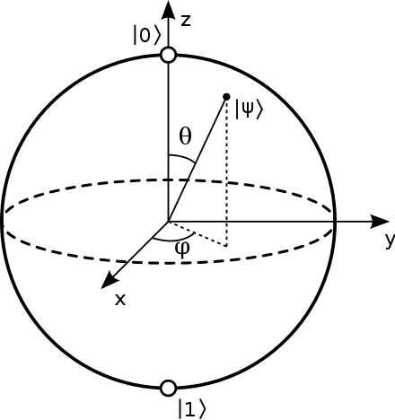

## 量子计算基础

### 量子比特和量子态叠加

比特是经典量子计算和量子信息中一个基本的概念。量子计算和量子信息同样建立在类似的概念量子比特(quantum bit或qubit)上，类似于经典比特可以处于0态或者1态，量子比特也有类似的态。

两个可能的量子态是 ∣0⟩和 ∣1⟩，他们类似于经典的比特0和1态。这里的 ∣⟩是物理学家喜欢用的狄拉克符号，在后续的介绍文章中我们将默认使用这一套Dirac符号描述体系。不同于经典比特的态信息，量子比特可以处于的状态除了 ∣0⟩和 ∣1⟩，还可以处于 ∣0⟩和 ∣1⟩的线性叠加态，在物理学上，我们称之为量子叠加态：

∣ψ⟩=α∣0⟩+β∣1⟩这里的 α和 β都是复数，并且 $∣α∣^2+∣β∣^2=1$。

上面的 ∣0⟩和 ∣1⟩是我们的计算的基矢量。数学上，可以把量子比特在基矢量 ∣0⟩和 ∣1⟩下张成二维的复矢量。为了更加直观的区分量子比特和经典比特，可以把经典比特的0和1理解为地球的南北极，如图所示，而量子比特 ∣ψ⟩则可以是部分南极部分北极组成的叠加状态，此状态具有无限多可能性。

布洛赫球如下：

### 量子纠缠

考虑到要实现一个复杂的量子计算机，必然需要涉及到复杂的多体量子体系。我们用直积⊗来描述两个量子体系组合成得复合量子体系，这个可以扩展到更多的量子体系。我们以两个量子比特为例，来仔细观察这个案例。对于量子态分别为 ∣ψ1⟩和 ∣ψ2⟩的两个量子比特，可以组成一个复合体系。

进一步从复合体系的角度来说，有些态可以描述为 ∣Ψ⟩=∣ψ1⟩∣ψ2⟩的乘积态，或者展开为:

$∣Ψ⟩=∣ψ1⟩⊗∣ψ2⟩=α1α2∣0⟩∣0⟩+α1β2∣0⟩∣1⟩+β1α2∣1⟩∣0⟩+β1β2∣1⟩∣1⟩$

我们默认量子比特坐标是从左到右分别为0,1,… 等。这两个直积形成的态在一起的复合态 ∣Ψ⟩叫做直积态(可分离态)。量子体系中除了这种态，还有一种不能用两个直积而生成得态，如贝尔态：

$∣Ψ_{Bell}⟩=2^{-\frac{1}{2}}∣00⟩+2^{-\frac{1}{2}}∣11⟩$

这样的一种态，无论如何没法分解成两个量子态的直积，我们称这样的态为量子纠缠态。量子纠缠作为重要的一种量子资源，广泛的应用在量子计算、量子通信中。

### 量子态演化和

在封闭体系中，一个量子态的演化可以用一个幺正变换来描述。一个t1时刻的量子态 ∣ψ(t1)⟩通过一个幺正算符U(unitary operator)可以变换到∣ψ(t2)⟩, 这个幺正算符仅取决于时间t1和t2，∣ψ(t2)⟩=U(t1,t2)∣ψ(t1)⟩。

再具体点说，一个封闭体系量子态的演化服从薛定谔方程，也就是$i\hbar \frac{\partial}{\partial t}|\psi\rangle = H|\psi\rangle$

在这个方程中 ℏ是物理学中普朗克常数，H是系统的哈密顿量(Hamiltonian)。简单来讲，一个量子体系，如果知道其初始态 $∣ψ_{t=0}⟩$, 以及Hamiltonian，则可以通过求解薛定谔方程知晓任意时刻态 $∣ψ_t⟩$。一般来说，类似与经典机器初始化，单量子比特的态会初始化在 ∣0⟩，即系统的初始化态一般是确定的，所以最重要的事情是构建系统的的Hamiltonian。

### 量子门操作

从计算的角度，可以将Hamiltonian的演化分解成各种单比特和两比特量子们的组合。类比于经典计算机，从一些们集合（如或门，与门和非们）出发，可以通过组合，完成任意的经典计算过程。类似的，一系列复杂的量子计算也可以通过构建对应的复杂Hamiltonian来实现，也就是可以通过分解成一系列的量子门的组合来实现量子计算。理论计算表明，使用单比特门和两比特门CNOT集合可构成任意量子计算的复杂门。

常用的单量子比特门包括 Pauli 门 $X, Y, Z$ 和 Hadamard 门 $H$, 以及如下的 phase gate $S$ 和 $T$ 门，其对应的矩阵表示为：

$$
X = \begin{bmatrix}0 & 1\\1 & 0\end{bmatrix}, 
Y = \begin{bmatrix}0 & -i\\i & 0\end{bmatrix}, 
Z = \begin{bmatrix}1 & 0\\0 & -1\end{bmatrix},
$$

$$
H = \frac{1}{\sqrt{2}} \begin{bmatrix}1 & 1\\1 & -1\end{bmatrix}, 
S = \begin{bmatrix}1 & 0\\0 & i\end{bmatrix}, 
T = \begin{bmatrix}1 & 0\\0 & e^{i\pi/4}\end{bmatrix}.
$$

对于任意态的叠加，我们以这样的方法为例表示一个量子比特的态。一个X门可以对态进行翻转：

$$
|\psi\rangle = \alpha|0\rangle + \beta|1\rangle
$$

$$
X|\psi\rangle = 
\begin{bmatrix}
0 & 1 \\
1 & 0 \\
\end{bmatrix}
\begin{bmatrix}
\alpha \\
\beta \\
\end{bmatrix} 
= \beta|0\rangle + \alpha|1\rangle
$$

Hadamard门可以用于变换用来制备叠加态和变换基矢：

$$
H|0\rangle = \frac{1}{\sqrt{2}}
\begin{bmatrix}
1 & 1\\
1 & -1\\
\end{bmatrix} 
[ 1, 0 ]^T = \frac{1}{2}(|0\rangle + |1\rangle)
$$

### 量子线路（电路）

与经典计算机类似，为了实现一个复杂的量子计算机计算过程，我们需要构造相应的量子电路。以下我们来展示Bell纠缠态的制备。

#### Bell纠缠态的制备

Bell态的制备需要两个qubit，假设qubit的初态为$$∣ψ_0\rangle=|00⟩$$，

对qubit1施加一个Hadamard 门操作，此时复合系统的态为：

$\psi_1=\frac1{\sqrt2}(∣0⟩+∣1⟩)∣0⟩   =\frac1{\sqrt2}(∣00⟩+∣10⟩)$

然后以qubit1为控制比特，qubit2为目标比特，施加CNOT门，此时系统演化为：

$\psi_2=\frac1{\sqrt2}(∣00⟩+∣11⟩)$

这样，通过Hadamard门和CNOT门，就制备了一个Bell纠缠态。通过改变初态组合，我们可以制备其他额外3种Bell态。

纠缠表示的是一种非局域的关联关系。 对于$Φ^+$，理想情况下，如果 qubit1 测量结果为0，则qubit2 的态也会塌缩到0态。如果qubit1 测量结果为1，则qubit2也会塌缩到量子态 1 上。

在实验中，需要通过关联测量以及量子态层析来表示纠缠态。然而随着体系增大，表达量子态的矩阵元素指数增大，重构量子态在理论和实验上都比较难以操作，所以多体复杂体系的纠缠的度量目前还是一个很值得研究的话题。